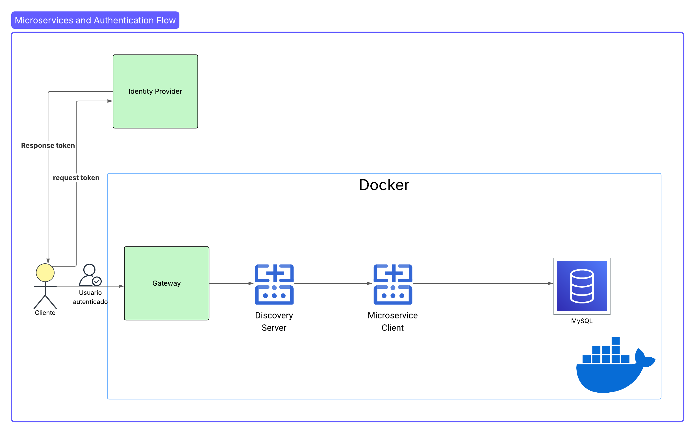
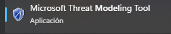
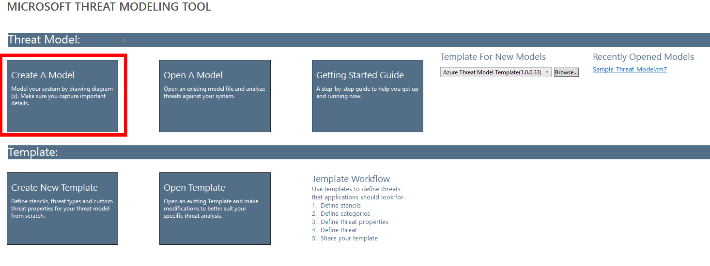
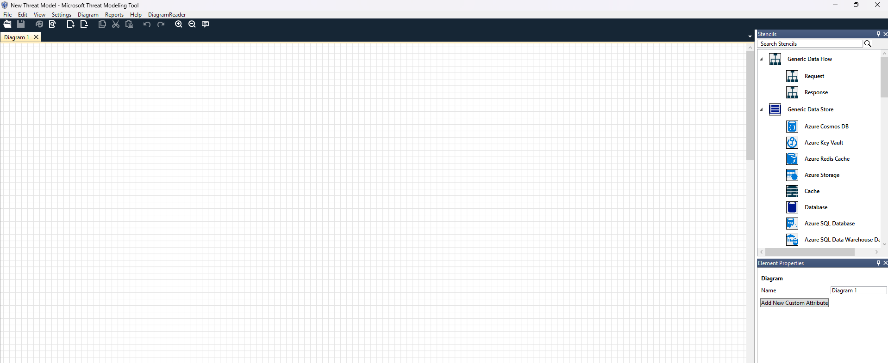
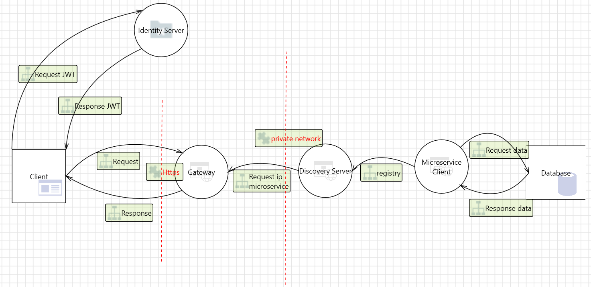
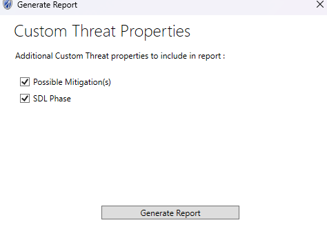
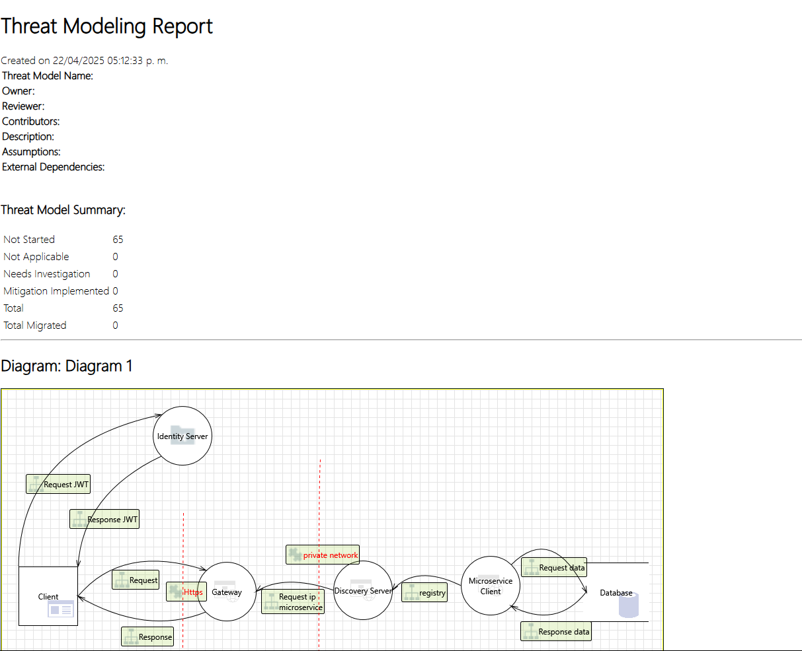
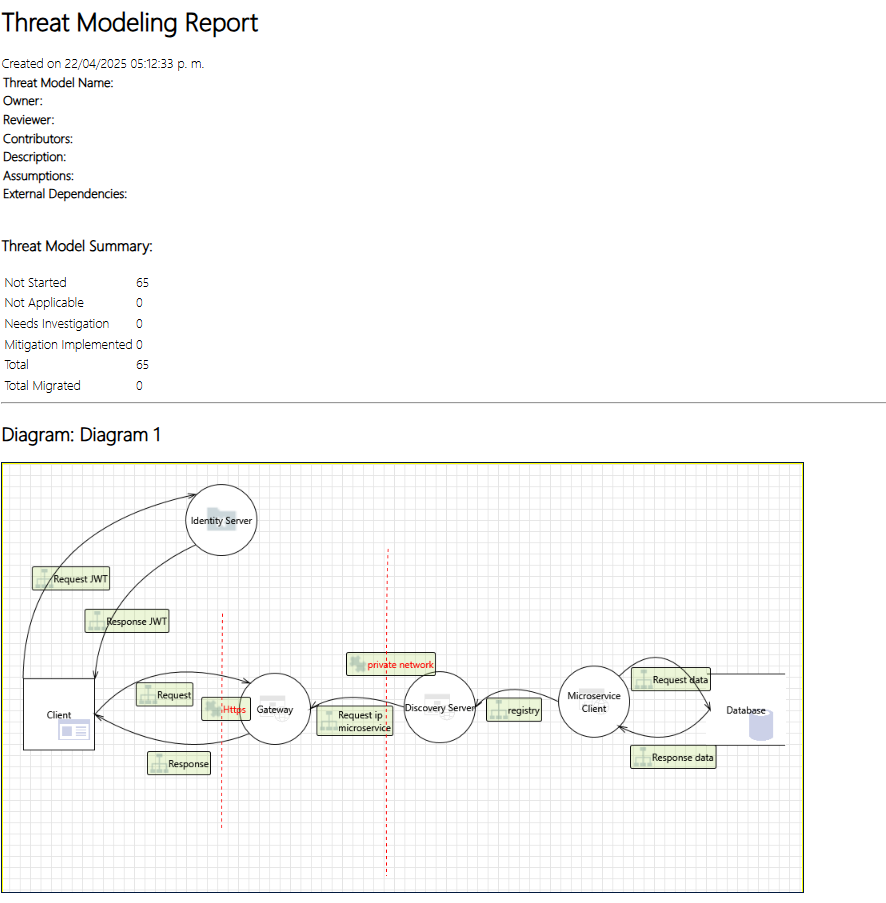

# Práctica 1. Modelado de amenazas con Microsoft Threat Modeling Tool

### Descripción:

En este laboratorio, deberás implementar un *modelo de amenazas para una aplicación orientada a microservicios*. Durante el proceso, observarás las posibles amenazas y explorarás estrategias para mitigarlas de manera efectiva. 

## Objetivos: 
Al finalizar la práctica, serás capaz de:
- Comprender la solicitud de la aplicación.
- Utilizar **Microsoft Modeling Tool** para identificar posibles amenazas en la arquitectura. 
- Elaborar un informe sobre las posibles amenazas detectadas. 

---
<!--Este fragmento es la barra de 
navegación-->

        <table width="50%">
            <tr>
                <td style="text-align: center;">
                    
                     Anterior
                </td>
                <td style="text-align: center;">
                   <a href="../README.md">Lista Laboratorios</a>
                </td>
<td style="text-align: center;">
                    
                     Siguiente
                </td>
            </tr>
        </table>

---

## Objetivo visual: 

En esta práctica, se espera que analices la estructura de la aplicación presentada a continuación: 

## Instrucciones:

Antes de comenzar, lee la siguiente información detalladamente sobre la aplicación propuesta en el diagrama anterior. 

> **IMPORTANTE:** Este diagrama ilustra la interacción entre los componentes de una arquitectura de microservicios, con especial énfasis en el flujo de autenticación. Los componentes clave incluyen un **Servidor de Descubrimiento**, un **Cliente de Microservicio**, una base de datos **MySQL**, un **Gateway** y un **Proveedor de Identidad**. El flujo inicia cuando un cliente solicita un token al Proveedor de Identidad, que responde con el token, permitiendo al cliente interactuar con los microservicios a través del Gateway.

Una vez comprendida la funcionalidad de la aplicación solicitada, se debe proceder con el modelado para identificar las posibles amenazas en el diagrama anterior. 

1. Para iniciar, abre **Microsoft Threat Modeling Tool**.

2. Selecciona **Create A Model**.

3. Con esto, se abrirá un workspace con todas las herramientas necesarias para crear un modelo. 

4. Define el siguiente diagrama con los elementos que se muestran a continuación. 

5. Los elementos utilizados para el diagrama son los siguientes: 

- **Web Application**
- **Identity Server**
- **Browser**
- **Generic Trust Line Boundary**
- **Database**
- **Request**
- **Response**

6. Posteriormente, guarda el modelo con el nombre **microservices-model**.

7. Luego, genera el reporte; para ello, da clic en: **Reports ➡️ Create Full Report**.

8. Guarda el reporte en el escritorio con el nombre **reporte**.

9. Después, analiza el reporte generado.

10. Realiza una lista que identifique en qué casos del ciclo de vida del software se implementa cada vulnerabilidad. 

- **Requirements (Requisitos):**

    - Se identifican los requisitos de seguridad.
    - Se determina el nivel de riesgo aceptable.

- **Design (Diseño):**

    - Aquí se realiza el modelado de amenazas.
    - Se identifican amenazas, mitigaciones y se documentan.

- **Implementation (Implementación):**

    - Se codifican las mitigaciones.
    - Se aplican prácticas seguras de desarrollo (como: validación de entradas, cifrado, entro otras).

- **Verification (Verificación / Pruebas):**

    - Pruebas de seguridad: análisis estático, dinámico, pruebas de penetración, etc.

- **Release (Liberación):**

    - Revisión final de seguridad.
    - Se valida que todos los riesgos fueron tratados adecuadamente.

- **Response (Respuesta / Mantenimiento):**

    - Planes de respuesta a incidentes y correcciones post-lanzamiento.

## Resultado esperado:

