# 10. Monitoreo de MicroservicioCliente con Grafana y Prometheus
En este laboratorio se espera que el alumno pueda implementar una arquitectura de microservicios en docker con monitoreo incluido. 

## Objetivos
- Usar docker compose para crear arquitectura
- Validar configuración de Prometheus
- Crear Dashboard en Grafana 

---

<div style="width: 400px;">
        <table width="50%">
            <tr>
                <td style="text-align: center;">
                    <a href="../Capitulo9/"></a>
                    <br>anterior
                </td>
                <td style="text-align: center;">
                   <a href="../README.md">Lista Laboratorios</a>
                </td>
<td style="text-align: center;">
                    <a href="../Capitulo11/"></a>
                    <br>siguiente
                </td>
            </tr>
        </table>
</div>

---


## Diagrama

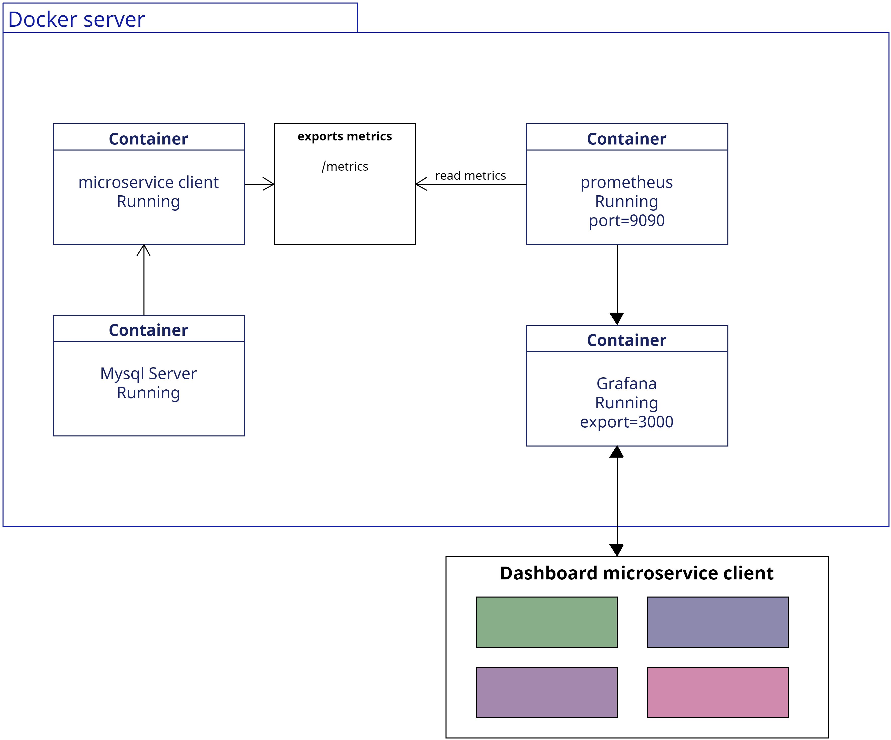


## Instrucciones

Este laboratorio esta separado en las siguientes secciones: 

- **[Configurar Grafana y Prometheus](#configurar-grafana-y-prometheus-return)**

- **[Crear Dashboard en Grafana](#crear-dashboard-en-grafana-return)**

## Configurar Grafana y Prometheus [return](#instrucciones)

1. Crearemos una carpeta que llamaremos **grafana y prometheus** en el escritorio

2. Abrimos la carpeta en **Visual Studio Code**

3. Añadiremos los siguientes archivos en la carpeta:

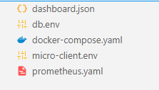

4. En el archivo **dashboard.json** agregaremos el siguiente contenido: 

```json
{
  "__inputs": [
    {
      "name": "DS_PROMETHEUS",
      "label": "prometheus",
      "description": "",
      "type": "datasource",
      "pluginId": "prometheus",
      "pluginName": "Prometheus"
    }
  ],
  "__elements": {},
  "__requires": [
    {
      "type": "panel",
      "id": "bargauge",
      "name": "Bar gauge",
      "version": ""
    },
    {
      "type": "grafana",
      "id": "grafana",
      "name": "Grafana",
      "version": "11.4.0"
    },
    {
      "type": "datasource",
      "id": "prometheus",
      "name": "Prometheus",
      "version": "1.0.0"
    },
    {
      "type": "panel",
      "id": "stat",
      "name": "Stat",
      "version": ""
    },
    {
      "type": "panel",
      "id": "timeseries",
      "name": "Time series",
      "version": ""
    }
  ],
  "annotations": {
    "list": [
      {
        "builtIn": 1,
        "datasource": {
          "type": "grafana",
          "uid": "-- Grafana --"
        },
        "enable": true,
        "hide": true,
        "iconColor": "rgba(0, 211, 255, 1)",
        "name": "Annotations & Alerts",
        "type": "dashboard"
      }
    ]
  },
  "editable": true,
  "fiscalYearStartMonth": 0,
  "graphTooltip": 0,
  "id": null,
  "links": [],
  "panels": [
    {
      "datasource": {
        "type": "prometheus",
        "uid": "${DS_PROMETHEUS}"
      },
      "fieldConfig": {
        "defaults": {
          "color": {
            "mode": "palette-classic-by-name"
          },
          "mappings": [],
          "thresholds": {
            "mode": "absolute",
            "steps": [
              {
                "color": "green",
                "value": null
              },
              {
                "color": "red",
                "value": 80
              }
            ]
          }
        },
        "overrides": []
      },
      "gridPos": {
        "h": 8,
        "w": 12,
        "x": 5,
        "y": 0
      },
      "id": 2,
      "options": {
        "displayMode": "lcd",
        "legend": {
          "calcs": [],
          "displayMode": "list",
          "placement": "bottom",
          "showLegend": false
        },
        "maxVizHeight": 300,
        "minVizHeight": 16,
        "minVizWidth": 8,
        "namePlacement": "auto",
        "orientation": "horizontal",
        "reduceOptions": {
          "calcs": [
            "lastNotNull"
          ],
          "fields": "",
          "values": false
        },
        "showUnfilled": true,
        "sizing": "auto",
        "valueMode": "text"
      },
      "pluginVersion": "11.4.0",
      "targets": [
        {
          "editorMode": "code",
          "expr": "flask_app_requests_total",
          "legendFormat": "{{method}}",
          "range": true,
          "refId": "A",
          "datasource": {
            "type": "prometheus",
            "uid": "${DS_PROMETHEUS}"
          }
        }
      ],
      "title": "Panel Title",
      "type": "bargauge"
    },
    {
      "datasource": {
        "type": "prometheus",
        "uid": "${DS_PROMETHEUS}"
      },
      "fieldConfig": {
        "defaults": {
          "color": {
            "mode": "thresholds"
          },
          "mappings": [
            {
              "options": {
                "0": {
                  "color": "red",
                  "index": 1,
                  "text": "DOWN"
                },
                "1": {
                  "color": "green",
                  "index": 0,
                  "text": "UP"
                }
              },
              "type": "value"
            },
            {
              "options": {
                "match": "null+nan",
                "result": {
                  "color": "red",
                  "index": 2,
                  "text": "DOWN"
                }
              },
              "type": "special"
            }
          ],
          "thresholds": {
            "mode": "absolute",
            "steps": [
              {
                "color": "green",
                "value": null
              },
              {
                "color": "red",
                "value": 80
              }
            ]
          }
        },
        "overrides": []
      },
      "gridPos": {
        "h": 9,
        "w": 9,
        "x": 2,
        "y": 8
      },
      "id": 1,
      "options": {
        "colorMode": "value",
        "graphMode": "area",
        "justifyMode": "auto",
        "orientation": "auto",
        "percentChangeColorMode": "standard",
        "reduceOptions": {
          "calcs": [
            "lastNotNull"
          ],
          "fields": "",
          "values": false
        },
        "showPercentChange": false,
        "textMode": "auto",
        "wideLayout": true
      },
      "pluginVersion": "11.4.0",
      "targets": [
        {
          "datasource": {
            "type": "prometheus",
            "uid": "${DS_PROMETHEUS}"
          },
          "editorMode": "code",
          "expr": "up {job=\"microservicecliente\"}",
          "legendFormat": "__auto",
          "range": true,
          "refId": "A"
        }
      ],
      "title": "Panel Title",
      "type": "stat"
    },
    {
      "datasource": {
        "type": "prometheus",
        "uid": "${DS_PROMETHEUS}"
      },
      "fieldConfig": {
        "defaults": {
          "color": {
            "fixedColor": "yellow",
            "mode": "fixed"
          },
          "custom": {
            "axisBorderShow": false,
            "axisCenteredZero": false,
            "axisColorMode": "text",
            "axisLabel": "",
            "axisPlacement": "auto",
            "barAlignment": 0,
            "barWidthFactor": 0.6,
            "drawStyle": "line",
            "fillOpacity": 0,
            "gradientMode": "none",
            "hideFrom": {
              "legend": false,
              "tooltip": false,
              "viz": false
            },
            "insertNulls": false,
            "lineInterpolation": "linear",
            "lineWidth": 1,
            "pointSize": 5,
            "scaleDistribution": {
              "type": "linear"
            },
            "showPoints": "auto",
            "spanNulls": false,
            "stacking": {
              "group": "A",
              "mode": "none"
            },
            "thresholdsStyle": {
              "mode": "off"
            }
          },
          "mappings": [],
          "thresholds": {
            "mode": "absolute",
            "steps": [
              {
                "color": "green",
                "value": null
              },
              {
                "color": "red",
                "value": 80
              }
            ]
          }
        },
        "overrides": []
      },
      "gridPos": {
        "h": 9,
        "w": 9,
        "x": 11,
        "y": 8
      },
      "id": 3,
      "options": {
        "legend": {
          "calcs": [],
          "displayMode": "list",
          "placement": "bottom",
          "showLegend": true
        },
        "tooltip": {
          "mode": "single",
          "sort": "none"
        }
      },
      "pluginVersion": "11.4.0",
      "targets": [
        {
          "editorMode": "code",
          "expr": "rate(flask_app_request_latency_seconds_sum[10m]) \r\n/\r\nrate(flask_app_request_latency_seconds_count[10m])",
          "legendFormat": "__auto",
          "range": true,
          "refId": "A",
          "datasource": {
            "type": "prometheus",
            "uid": "${DS_PROMETHEUS}"
          }
        }
      ],
      "title": "Latencia últimos10 minutos",
      "type": "timeseries"
    }
  ],
  "refresh": "5s",
  "schemaVersion": 40,
  "tags": [],
  "templating": {
    "list": []
  },
  "time": {
    "from": "now-6h",
    "to": "now"
  },
  "timepicker": {},
  "timezone": "browser",
  "title": "New dashboard",
  "uid": "fenw8dihslon4d",
  "version": 4,
  "weekStart": ""
}
```

5. En el archivo **db.env** añadiremos el siguiente contenido: 

```properties
MYSQL_DATABASE=datadb
MYSQL_ROOT_PASSWORD=1234
```

6. En el archivo **docker-compose.yaml** añadiremos el siguiente contenido: 

```yaml
services:

  prometheus:
    container_name: prometheus
    image: edgardovefe/pgclase:prometheus
    volumes:
      - './prometheus.yaml:/etc/prometheus/prometheus.yml'
    depends_on:
      microclient:
        condition: service_healthy
    ports:
      - 9090:9090
    networks:
      - microservicenetwork
    
  grafana:
    container_name: grafana
    image: edgardovefe/pgclase:grafana
    ports:
      - 3000:3000
    environment:
      - GF_SECURITY_ADMIN_PASSWORD=pass
    volumes:
      - grafana-storage:/var/lib/grafana
    networks:
      - microservicenetwork


  mysqlserver:
    container_name: mysqlserver
    image: "mysql:8.0"
    env_file:
      - db.env
    networks:
      - microservicenetwork
    healthcheck:
      test: mysqladmin ping -uroot -p${MYSQL_ROOT_PASSWORD} -hlocalhost
  
  microclient:
    container_name: microclient
    image: edgardovefe/devsecopspy:microservicegrafana
    env_file:
      - micro-client.env
    networks:
      - microservicenetwork
    ports:
      - 8082:8082
    depends_on:
      mysqlserver:
        condition: service_healthy
    healthcheck:
      test: curl -f http://localhost:8082/client

volumes:
  grafana-storage:

networks:
  microservicenetwork:
    driver: bridge
    ipam:
      config:
        - subnet: 192.168.32.0/24
          gateway: 192.168.32.1
```

7. En el archivo **micro-client.env** añadiremos el siguiente contenido: 

```properties
NAME_DB=datadb
IP_DB=mysqlserver
PORT_DB=3306
AZURE_TENANT_ID=<tenant_id>
AZURE_CLIENT_ID=<client_id>
AZURE_CLIENT_SECRET=<app_secret>
KEYVAULT_URI=<uri_key_vault>
```
> **IMPORTANTE:** Sustituye los valores por la información del **app registry de Azure**


8. En el archivo **prometheus.yaml** añade el siguiente contenido:


```yaml
global:
  scrape_interval: 5s

scrape_configs:
  - job_name: 'microservicecliente'
    metrics_path: '/metrics'
    static_configs:
      - targets: ['microclient:8082']
```

9. Ahora en **Visual Studio Code** abriremos una terminal. 

10. Ejecutamos el siguiente comando (asegurarse de ejecutar el comando estando en la misma ruta donde se encuentra el archivo **docker-compose.yaml**):

```bash
docker-compose up -d
```

> **NOTA:** El comando anterior iniciará toda la infraestructura con nuestro microservicio cliente, grafana y prometheus (tarda un poco el comando). 


11. Validar que el comando tenga una salida similar a la siguiente: 


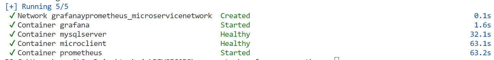

12. Validar que los contenedores esten iniciados con el comando:

```bash
docker ps
```

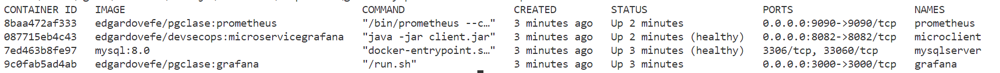

> **IMPORTANTE:** Deben de ser 4 contenedores iniciados. 


## Crear Dashboard en Grafana [return](#instrucciones)

1. Abrir un explorador web y escribir la dirección **http://localhost:3000**

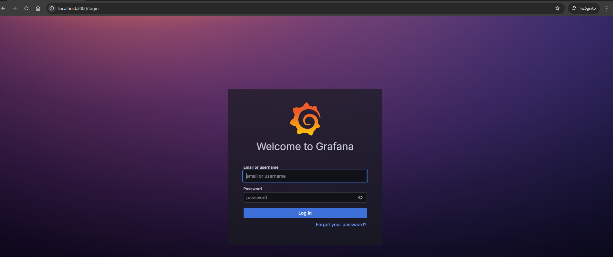

2. Nos pedira un usuario y contraseña:

- user: **admin**
- password: **pass**

3. Estando dentro de la herramienta buscar la opción  de **Connections->Add new Connection** en el menú de grafana

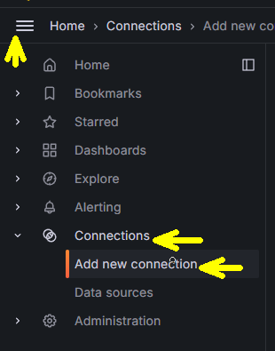

4. Busca **prometheus** 

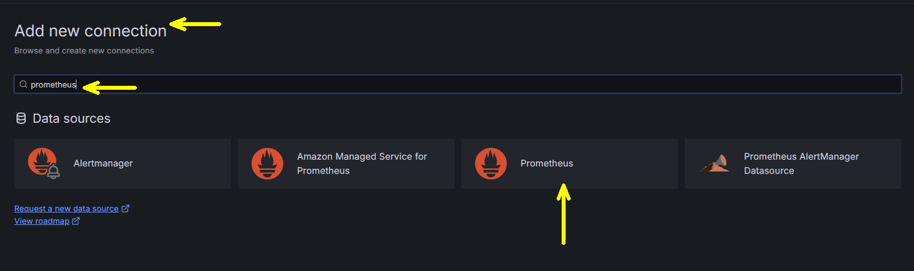

5. Ahora Selecciona **Add new data source**


6. Crearemos el datasource con la siguiente información:

- Name: **prometheus**
- Prometheus server URL: **http://prometheus:9090**

- Todo lo demas se deja por default

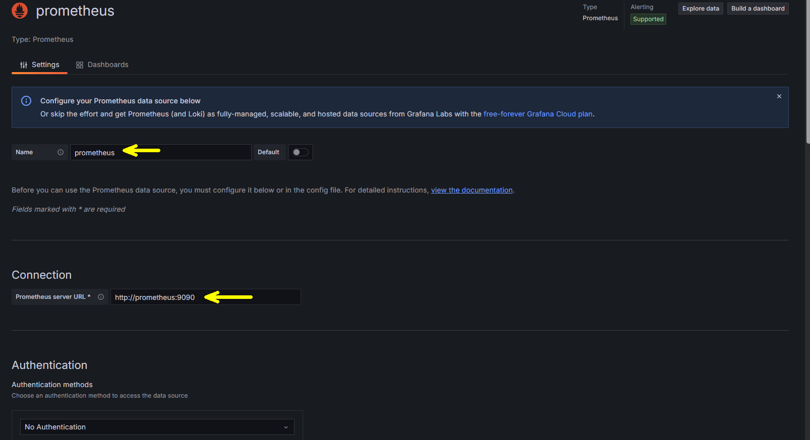

7. Almacena el datasource navegando hasta el final de las opciones de prometheus y sólo pulsa **Save & test**


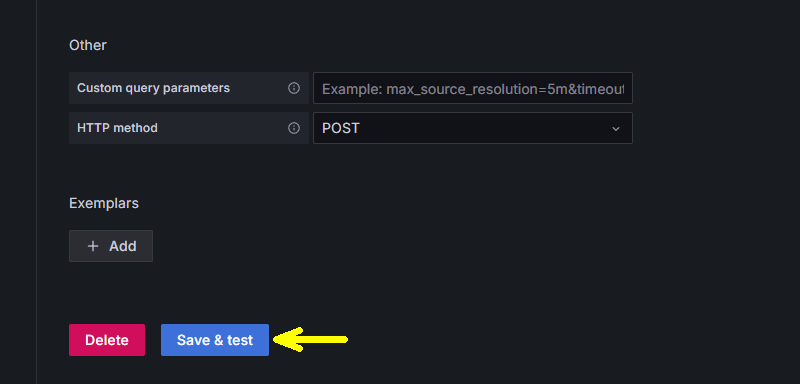

8. Ahora nos vamos al menú de grafana y seleccionaremos **Dashboards**

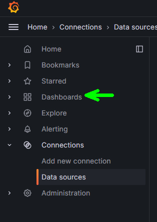

9. En **Dashboards** ahora seleccionamos **New->Import**

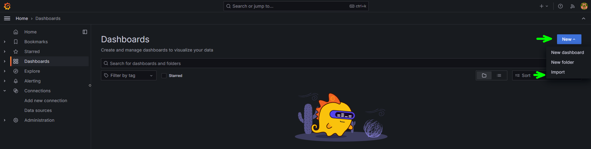

10. Seleccionamos **Upload dashboard JSON file** y seleccionamos el archivo dashboard.json que tenemos en nuestra carpeta **prometheus y grafana** 


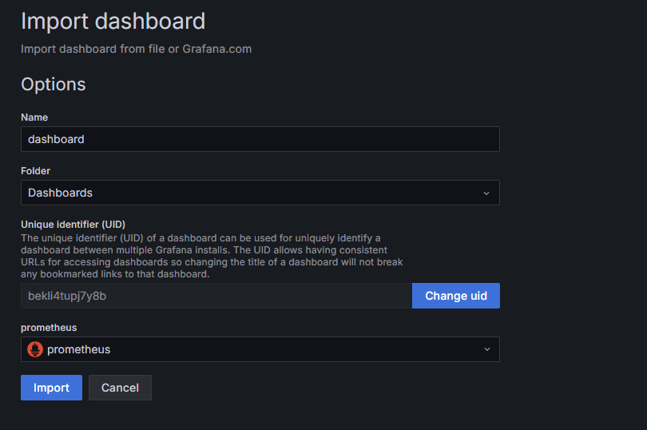

11. Seleccionamos el datasource **prometheus**

12. Si hemos realizado correctamente las instrucciones deberíamos de observar el siguiente dashboard:


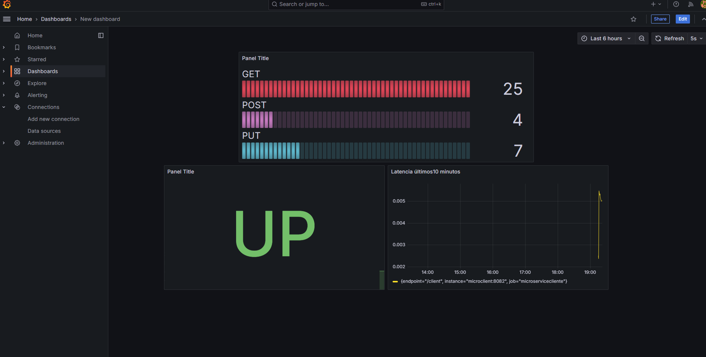


## Resultado Esperado

si hemos llegado hasta aquí, el alumno ha implementado correctamente un dashboard de monitoreo para su microservicio cliente. 


