# 2. Análisis de seguridad y códificación de un API Rest Python
En este laboratorio se espera que el alumno pueda códificar un API REST con Python usando las buenas prácticas de seguridad y pueda realizar análisis de código para buscar vulnerabilidades de código usando snyk y sonarqube.


## Objetivos
- Desarrollar un api restful usando las buenas prácticas en el diseño de código con python 3.13. 


- Analizar nuestro código usando snyk para buscar vulnerabilidades

- Analizar nuestro código usando sonarQube para la busqueda de vulnerabilidades en nuestro código. 


---
<!--Este fragmento es la barra de 
navegación-->

<div style="width: 400px;">
        <table width="50%">
            <tr>
                <td style="text-align: center;">
                    <a href="../Capitulo1/"></a>
                    <br>anterior
                </td>
                <td style="text-align: center;">
                   <a href="../README.md">Lista Laboratorios</a>
                </td>
<td style="text-align: center;">
                    <a href="../Capitulo3/"></a>
                    <br>siguiente
                </td>
            </tr>
        </table>
</div>

---

## Diagrama

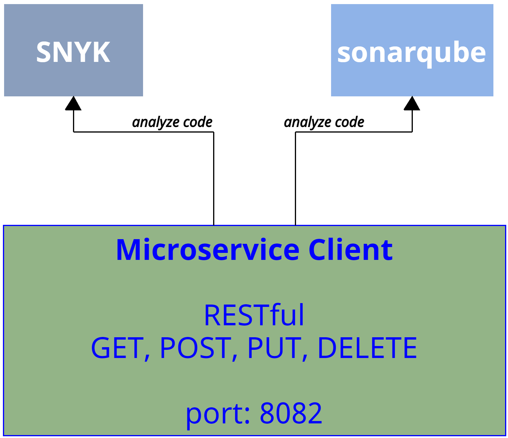

<br>


## Instrucciones
> **IMPORTANTE:** Antes de iniciar el laboratorio es necesario tener una cuenta de **gmail** y una cuenta **github** para el registro de las herramientas. 

Este laboratorio esta separado en las siguientes secciones:

- **[Códificar Microservicio Client](#códifica-microservicio-client-return)**
- **[Análisis de seguridad de código con SNYK](#análisis-de-seguridad-de-código-snyk-return)**
- **[Análisis de seguridad de código con SONARQUBE](#análisis-de-seguridad-de-código-con-sonarqube-return)**

### Códifica Microservicio Client [return](#instrucciones)
1. Crear una carpeta en el escritorio que llamaremos **microserviceclient**

2. Abrimos la carpeta en **Visual Studio Code**

3. Crearemos los siguientes elementos:

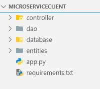

3.1 Añadimos el siguiente contenido en el archivo **requirements.txt**

```properties
flask==3.1.0
sqlalchemy==2.0.41
mysql-connector-python==9.2.0
```


4. En el paquete **entities**
añadiremos 2 archivos:

- **_\_init__.py**: Este archivo sólo se agrega para que python reconozca la carpeta **entities** cómo un paquete
- **model.py**: Se define el modelo que usaremos para nuestro microservicios

**model.py**
```python
from sqlalchemy import Column, Integer, String
from sqlalchemy.ext.declarative import declarative_base

Base=declarative_base()

class Client(Base):
    __tablename__="clients"
    id= Column(Integer, primary_key=True, autoincrement=True)
    name=Column(String(50))
    email=Column(String(150))
    address=Column(String(200))
```

5. En la carpeta **database** añadiremos los siguientes archivos:

- **_\_init__.py**: Necesario para indicar que una carpeta es un paquete

- **configuration.py**: Aquí se definen las variables de ambientes que usaremos en el proyecto. 

- **db_session.py**: En este archivo se definen los objetos que nos ayudarán a crear la sesión local de base de datos.

**configuration.py**
```python
import os

name_db=os.getenv("NAME_DB","appdb")
user_db=os.getenv("USER_DB","root")
password_db=os.getenv("PASSWORD_DB","1234")
ip_db=os.getenv("IP_DB","localhost")
port_db=os.getenv("PORT_DB","3306")

class Config:
    SQLALCHEMY_DATABASE_URI=f"mysql+mysqlconnector://{user_db}:{password_db}@{ip_db}:{port_db}/{name_db}"
    SQLALCHEMY_TRACK_MODIFICATIONS=False
```

**db_session.py**
```python
from sqlalchemy import create_engine
from sqlalchemy.orm import sessionmaker
from .configuration import Config

engine = create_engine(Config.SQLALCHEMY_DATABASE_URI)
SessionLocal = sessionmaker(bind=engine)
```

6. Ahora en la carpeta **dao** añadiremos los siguientes archivos:

- **_\_init__.py**: Necesario para indicar que la carpeta es un paquete.

- **use_cases.py**: En este archivo se indican las operaciones del CRUD que se realizarán a la base de datos. 

**use_cases.py**
```python
from entities.model import Client
from database.db_session import SessionLocal

def insert_client(client:Client)->bool:
    with SessionLocal() as session:
        if client:
            session.add(client)
            session.commit()
            return True

def select_all()->list:
    with SessionLocal() as session:
        all=session.query(Client).all()
        return all

def update_client(client:Client)->bool:
    with SessionLocal() as session:
        result=session.query(Client).filter(Client.id == client.id).update({
            Client.name:client.name,
            Client.address:client.address,
            Client.email:client.email
        })
        session.commit()
        return result>0


def delete_client(id:int)->bool:
    with SessionLocal() as session:
        result = session.query(Client).filter(Client.id == id).delete()
        session.commit()
        return result>0
```

7. Ahora en la carpeta **controller** añadiremos los siguientes archivos: 

- **_\_init__.py**: Necesario para indicar que la carpeta es un paquete.

- **routes.py**: En este archivo se las rutas que tendrá nuestro microservicio usando HTTP protocol. 

**routes.py**
```python
from flask import Blueprint, request, jsonify
from dao import use_cases
from entities.model import Client

client_bp=Blueprint("client_bp", __name__)
request_mapping="/client"

@client_bp.route(request_mapping, methods=["POST"])
def insert():
    data= request.get_json()
    if not data:
        return {"message":"bad request"},400
    client=Client(**data)
    if use_cases.insert_client(client):
        return {"message":"inserted"},201
    else:
        return {"message":"server error"}, 500


@client_bp.route(request_mapping, methods=["GET"])
def select_all():
    data=use_cases.select_all()
    if data:
        json=[{"id":tmp.id, "name":tmp.name, "email":tmp.email, "address":tmp.address} for tmp in data]
        return jsonify(json), 200
    else:
        return {"message":"internal error"}, 500

@client_bp.route(request_mapping, methods=["PUT"])
def update():
    data=request.get_json()
    if data and data["id"]:
        client=Client(**data)
        if use_cases.update_client(client):
            return {"message":"updated"}, 200
    else:
        return {"message":"bad request"}, 400
    return {"message":"internal error"}, 500
    

@client_bp.route(request_mapping, methods=["DELETE"])
def delete():
    id=request.args["id"]
    if id:
        if use_cases.delete_client(id):
            return {"message":"deleted"}, 200
    else:
        return {"massage":"bad request"}, 400
    return {"message":"server error"}, 500
```


8. Añadir el siguiente contenido en el archivo **app.py**

**app.py**
```python
from flask import Flask
from database.db_session import engine
from entities.model import Base
from controller.routes import client_bp


app= Flask(__name__)

#create tables
Base.metadata.create_all(engine)

# registry routes
app.register_blueprint(client_bp)

if __name__=="__main__":
    app.run(debug=True, port=8082)
```


### Análisis de seguridad de código SNYK [return](#instrucciones)

1. Abrir el siguiente enlace **https://app.snyk.io/login**, y iniciar sesión usando su cuenta de **google**

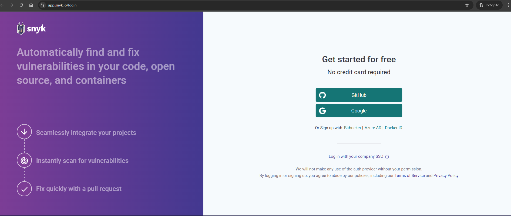

2. Ahora instalar en **Visual Studio Code** la extensión  **Snyk Security**

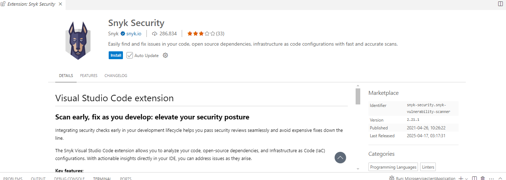

3. En las opciones de **SNYK** usar la opción **Enable Synk Code and start analyzing**

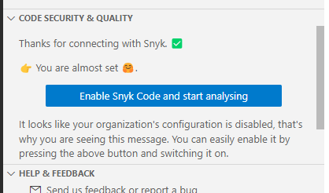

> **IMPORTANTE:** Al sincronizar nuestro proyecto a **snyk** nos pedira iniciar sesión con nuestra cuenta creada en los puntos anteriores. 

4. En la plataforma de **Snyk** activar el análisis de código. 

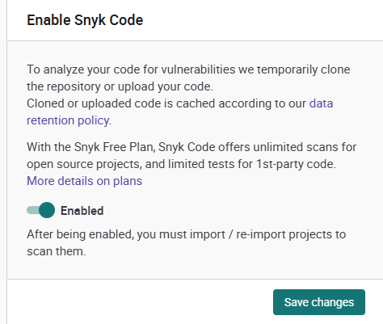

5. Ahora reescanear el proyecto completo y esperar el análisis de seguridad.

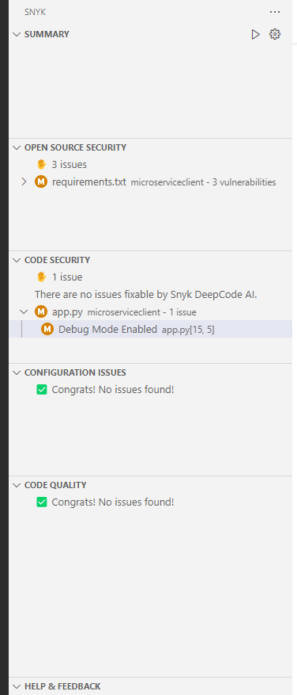


6. Analizar las recomendaciones de seguridad que nos entrega la herramienta.


### Análisis de seguridad de código con SONARQUBE [return](#instrucciones)

1. Abrir el siguiente enlace **https://sonarcloud.io/login** iniciar sesión usando tu cuenta de **github**

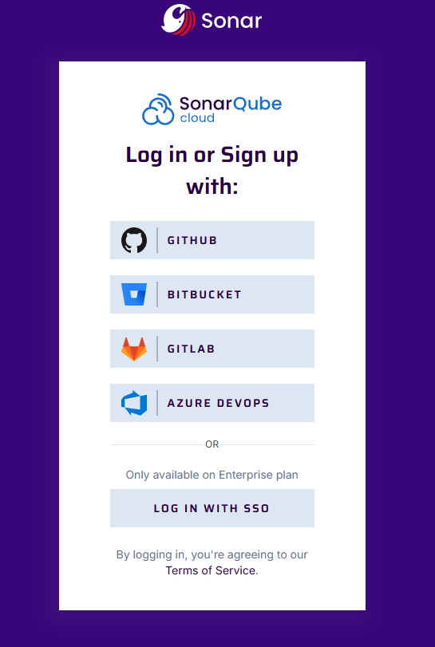

2. Al iniciar tu cuenta de **Sonar Cloud** añadir un nuevo proyecto. 

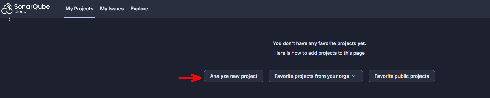


3. Seleccionar la opción **create a project manually**

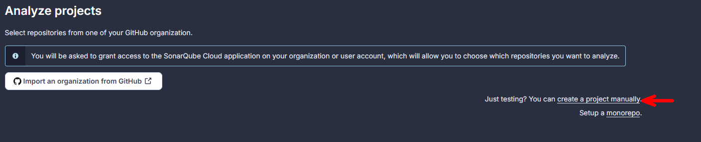


4. Crear una nueva organización con el nombre **netec**

5. Añadir un proyecto **Analyze projects** con las siguientes opciones:

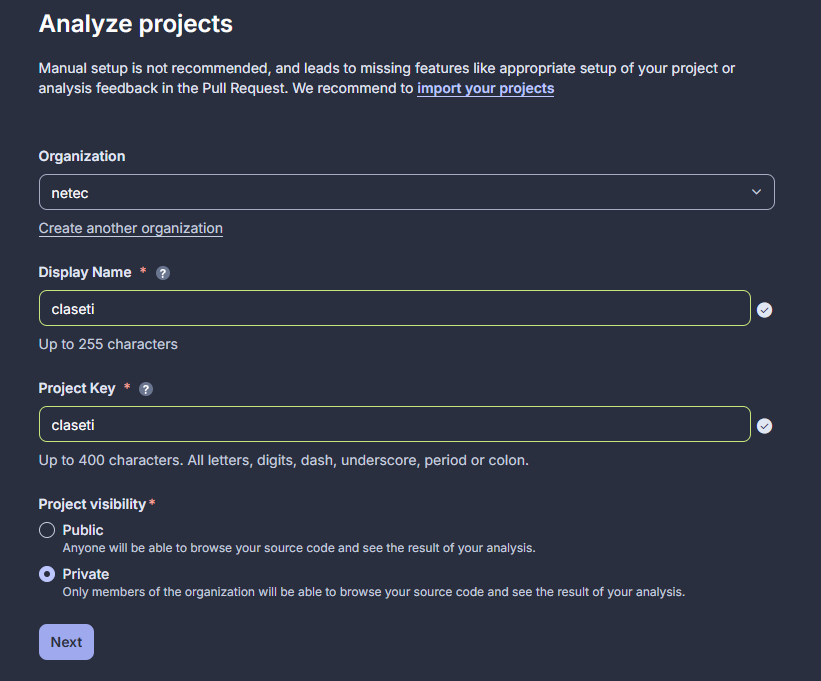

6. Set up project con las siguientes opciones

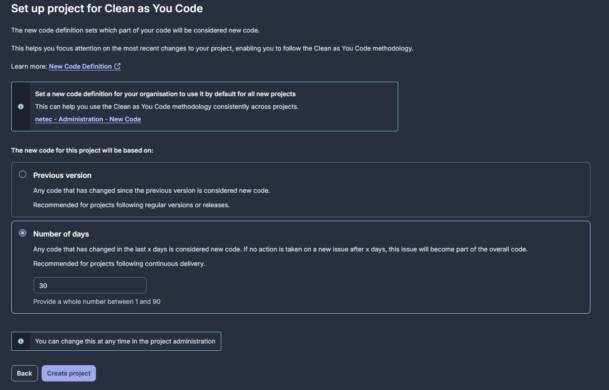

7. Ahora en **Visual Studio Code** instalar la extensión **SonarQube for IDE**:

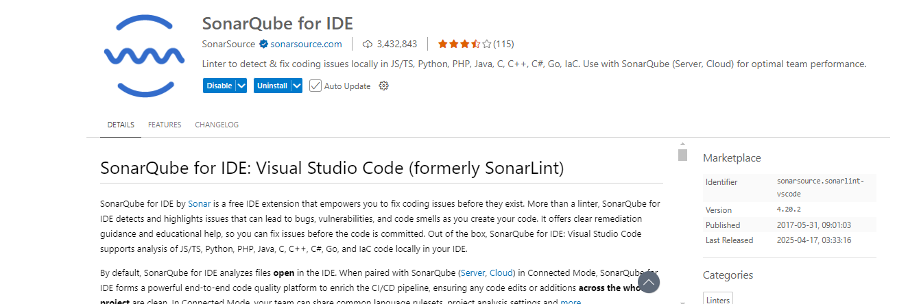

8. En las opciones de la extensión configurar **Add SonarQube Cloud Connection**

9. Pulsar **Generate token**, en esta opción nos pedira iniciar sesión con nuestra cuenta de **SonarQube** y nos pedira seleccionar la **Organización**

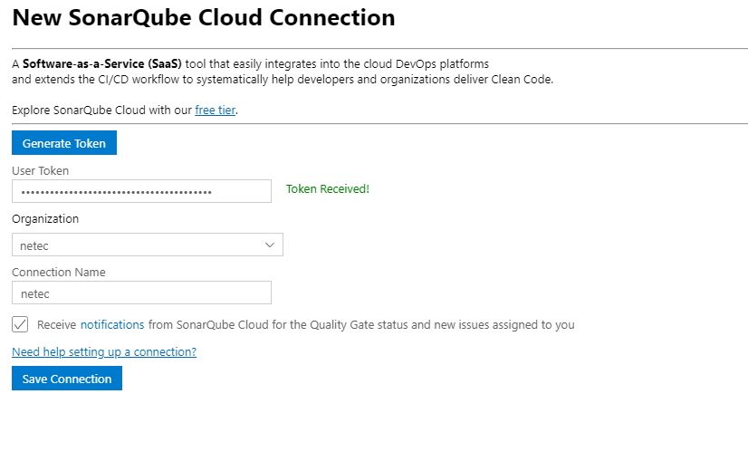

10. Ahora debemos enlazar el proyecto creado en **sonarcloud** con el proyecto que tenemos con **visual studio code** 

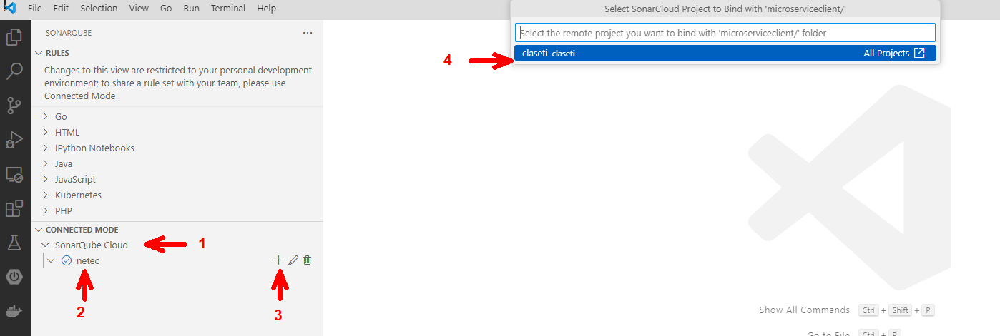

11. Esperaremos que termine de analizar todos los archivos de **Microservice Client** 

12. En **Security HOSTSPOSTS** observaremos el reporte de posibles problemas de seguridad:

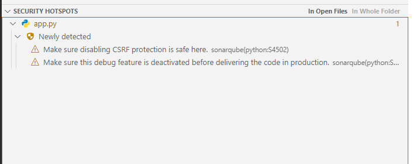


13. Si visitas cada archivo de tu proyecto observaras que **Sonarqube** te realiza recomendaciones de código limpio y te permite mejorarlo. 


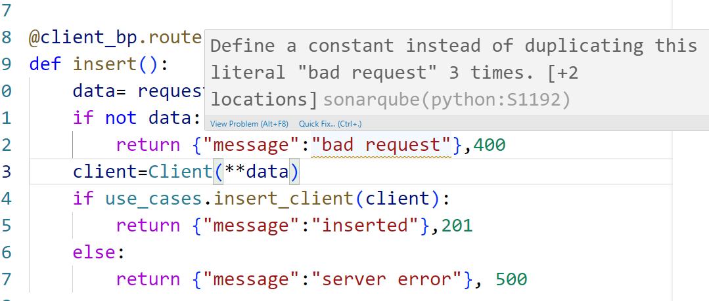


14. Analiza los resultados


## Resultado esperado
Al final de la práctica el alumno podra observar los resultados de los análisis de 2 herramientas orientadas a la seguridad de código y mejora continua del mismo. 

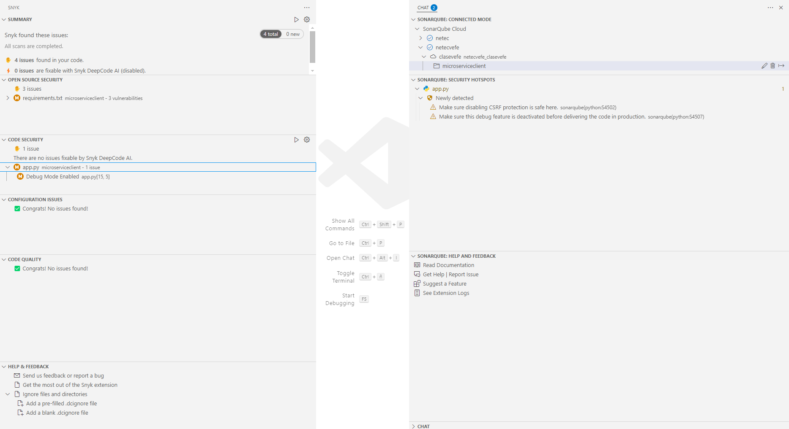
