# Práctica 3. Analizar dependencias y librerías del Microservicio Cliente usando Snyk y Safety para Python

## 📝 Planteamiento de la práctica:
En este laboratorio, se espera que puedas revisar la salud de las dependencias de su microservicio usando **Snyk y Safety para Python**.

## 🎯 Objetivos:
Al finalizar la práctica, serás capaz de:
- Usar **Snyk** para escanear tu proyecto y detectar vulnerabilidades en sus dependencias.
- Usar **Safety** para identificar vulnerabilidades en las dependencias definidas en el archivo **requirements.txt**.

## 🕒 Duración aproximada:
- 40 minutos.

## 🔍 Objetivo visual:
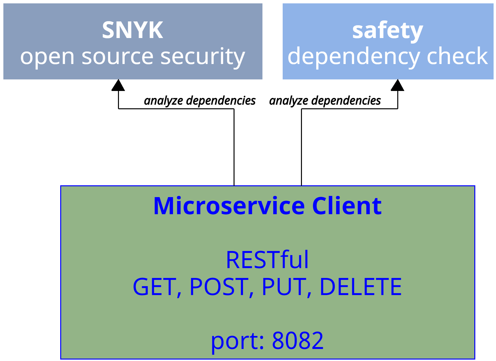

---

**[⬅️ Atrás](https://netec-mx.github.io/DEVSECOPS_PYT/Capitulo2/)** | **[🗂️ Lista general](https://netec-mx.github.io/DEVSECOPS_PYT/)** | **[Siguiente ➡️](https://netec-mx.github.io/DEVSECOPS_PYT/Capitulo4/)**

---

## Instrucciones:
Este laboratorio está dividido en las siguientes secciones:
- **[Análisis de dependencias usando SNYK](#análisis-de-dependencias-usando-snyk-return)**

- **[Análisis de dependencias usando safety dependency check](#análisis-de-dependencias-usando-safety-dependency-check-return)**

## Análisis de dependencias usando SNYK [return](#instrucciones)

> ⚠️ _**IMPORTANTE:** Necesitas tu cuenta de Snyk creada en el laboratorio **Análisis de seguridad y codificación de una API REST con Python Flask**. Si aún no la tienes, regresa a ese laboratorio y sigue las instrucciones para obtenerla._

Paso 1. Abre **Visual Studio Code**.
Paso 2. De igual forma, abre el proyecto del **MicroservicioCliente**.
Paso 3. Valida que tienes instalada la extensión **Snyk Security**.

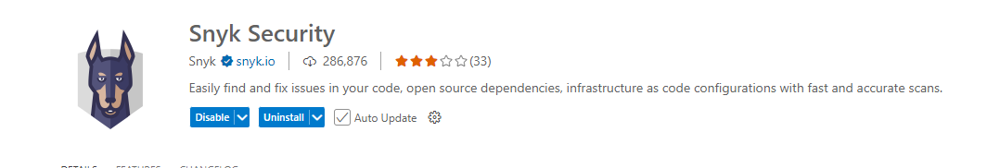

Paso 4. En la barra lateral de **Visual Studio Code**, pulsa el ícono de **snyk**.

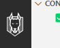

Paso 5. Realiza un nuevo escaneo, pero esta vez pon especial atención en la sección **Open Source Security**.

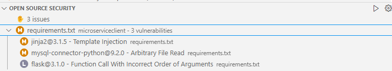

Paso 6. Verás que hay dos problemas de seguridad en dos dependencias. Haz clic en cualquiera de ellos para consultar más información sobre el problema. 

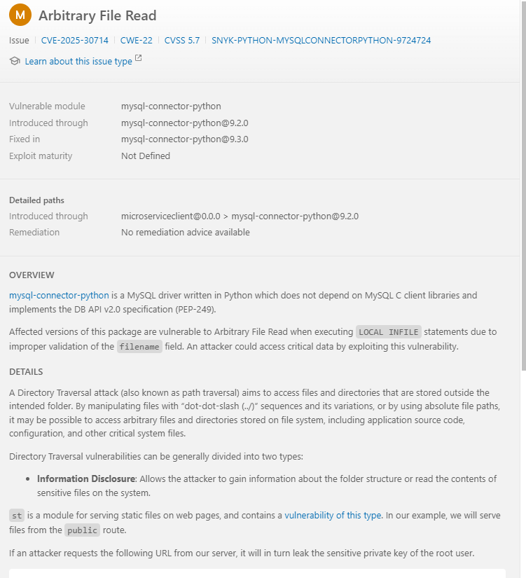

Paso 7.  La herramienta te alertará que la dependencia **MySQL connector** tiene un problema.

Paso 8. Abre la página de **Snyk** para obtener más detalles sobre este problema. 

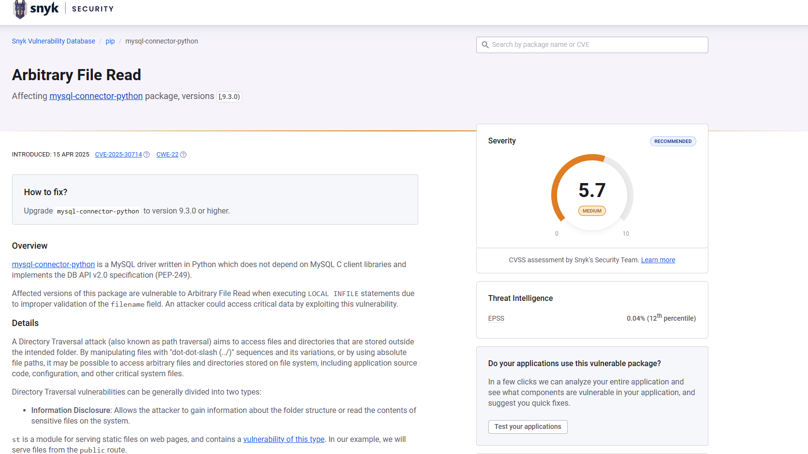

>  💡 ***Nota:** Este problema de seguridad significa que un atacante se podría conectar a nuestro sistema de archivos usando variaciones de rutas para tratar de obtener información sensible dentro de la aplicación.*

Paso 9. Ahora bien... ¿deberías asustarte por esta situación? La respuesta corta es: **no**, siempre y cuando tomes precauciones como:

- Ocultar la información sensible de tu aplicación. 
- Restringir el acceso a la base de datos solo a las IPs necesarias. 
- Usar una **VPN** o un **SSH tunnel** para conectarte a recursos externos.
- Mantener tus recursos dentro de una red privada.

Paso 10. Por ahora, nuestra aplicación no requiere modificar las dependencias. Sin embargo, es importante que tomes las precauciones mencionadas. 

## Análisis de dependencias usando safety dependency check [return](#instrucciones)

**safety** es un escáner de vulnerabilidades de dependencia diseñado para mejorar la seguridad de la cadena de suministro de software y permitir el uso seguro de paquetes de Python, desde el desarrollo hasta la implementación.

Paso 1. Abre el proyecto del **Microservicio Cliente** 

Paso 2. Abre una terminal en **Visual Studio Code**. 

Paso 3. Instala **Safety* usando el siguiente comando:

```bash
pip install safety
```

Paso 4. Ahora, realiza un escaneo de seguridad usando el siguiente comando:

```bash
safety scan
```

Paso 5. Al ejecutar el comando anterior, necesitarás registrarte en la herramienta Safety para poder acceder a su base de datos de vulnerabilidades:

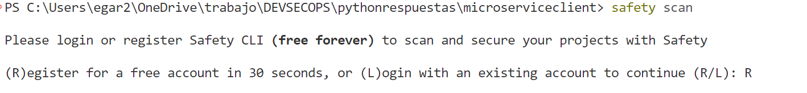

Paso 6. Al aceptar el registro, se abrirá una página web donde deberás completar tu registro

> 💡***Nota:** Se recomienda usar tu cuenta de Gmail.*

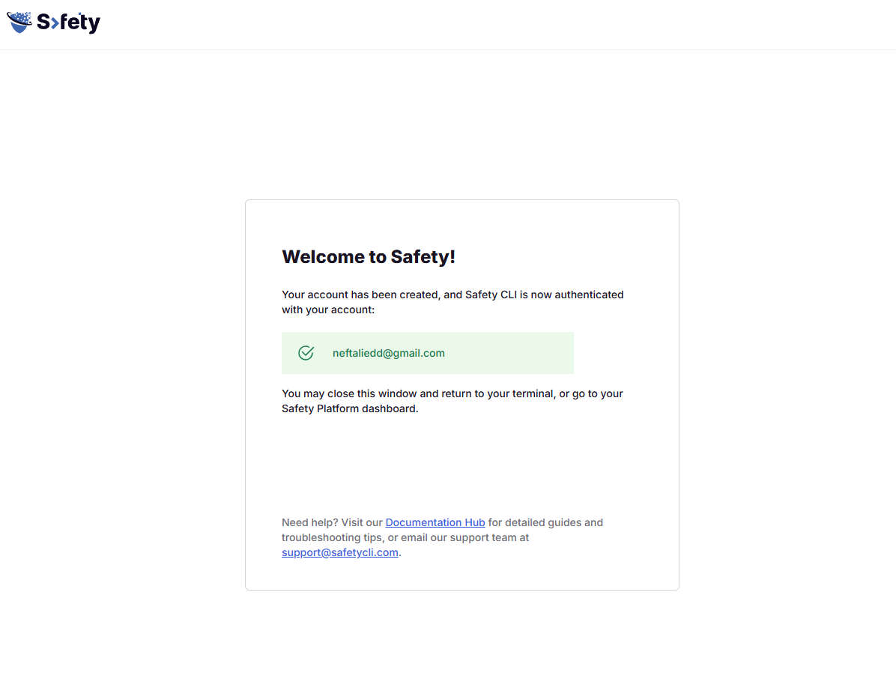

Paso 7. Al finalizar el registro, podrás realizar el escaneo de seguridad usando nuevamente el comando:

```bash
safety scan
```

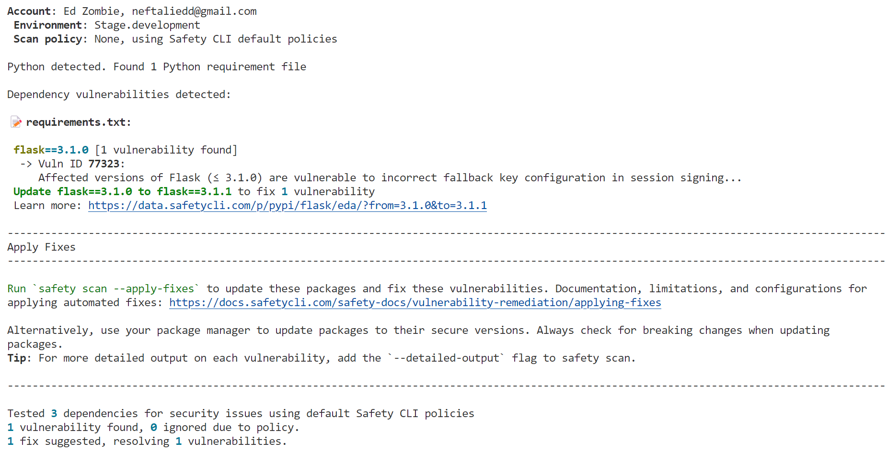

Paso 8. Como puedes ver en el análisis de seguridad, se detectó una vulnerabilidad en la dependencia **flask**. 

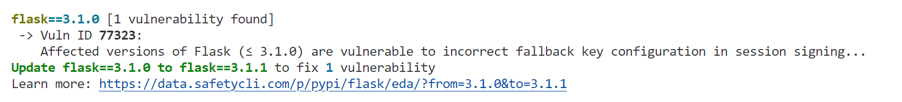

Paso 9. Si vistitas la página de **safety**, podrás encontrar más información sobre esta vulnerabilidad. 

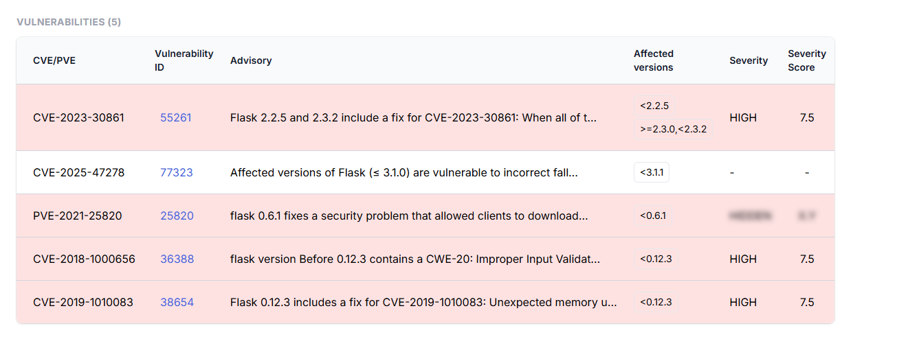

Paso 10. Al ser una vulnerabilidad con un score de severidad de 7.5 es recomendable solucionarla. La documentación nos dice que usemos la versión 3.1.1. 

Paso 11. Abre el archivo **requirements.txt** y actualiza la versión de **Flask** a 3.1.1.

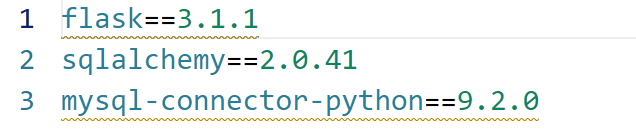

Paso 12. Nuevamente, realiza un escaneo usando el comando:

```bash
safety scan
```

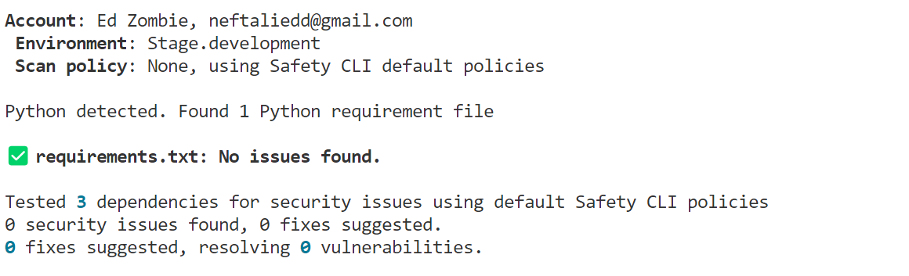

> 💡 ***NOTA:** Observa que ya no muestra vulnerabilidades al cambiar la versión de Flask.*

## Resultado esperado: [Instrucciones](#instrucciones)

Al finalizar, tendrás dos análisis de vulnerabilidades en dependencias de Python.

**snyk**


**safety**


---

**[⬅️ Atrás](https://netec-mx.github.io/DEVSECOPS_PYT/Capitulo2/)** | **[🗂️ Lista general](https://netec-mx.github.io/DEVSECOPS_PYT/)** | **[Siguiente ➡️](https://netec-mx.github.io/DEVSECOPS_PYT/Capitulo4/)**

---
