# Práctica 4. Gestión de secretos del Microservicio Cliente con Azure Key Vault

## 📝 Planteamiento de la práctica:

Es necesario proteger los datos de la base de datos y no almacenarlos en el microservicios cómo método de seguridad, para realizar esto usaremos **Azure Key Vault** para la protección de la información. 

## 🎯 Objetivos:
Al finalizar la práctica, serás capaz de:
- Configurar un registro de aplicación en el directorio activo de azure. 
- Crear y configurar un **Azure Key Vault**
- Conectar nuestro **Microservicio Cliente** a Azure Key Vault para obtener la información de la base de datos. 

## 🕒 Duración aproximada:
- 60 minutos.

## 🔍 Objetivo visual:

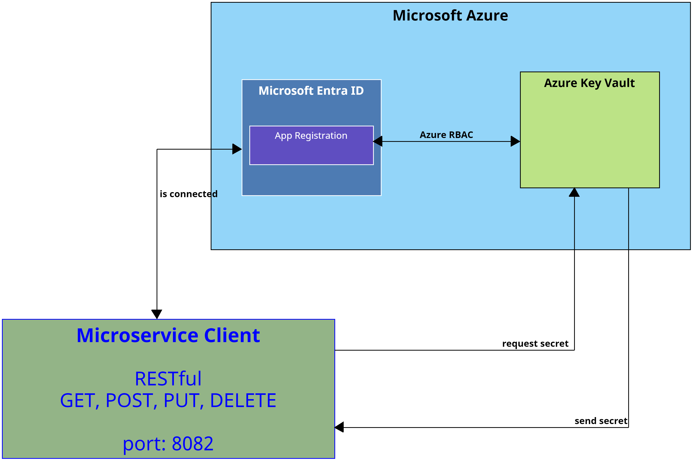

---

**[⬅️ Atrás](https://netec-mx.github.io/DEVSECOPS_PYT/Capitulo3/)** | **[🗂️ Lista general](https://netec-mx.github.io/DEVSECOPS_PYT/)** | **[Siguiente ➡️](https://netec-mx.github.io/DEVSECOPS_PYT/Capitulo5/)**

---
## Instrucciones:
Este laboratorio está dividido en las siguientes secciones:

- **[App Registration en Azure](#app-registration-en-azure-return)**
- **[Configuración Azure Key Vault](#configuración-azure-key-vaultreturn)**

- **[Configuración Microservicio Cliente](#configuración-microservicio-cliente-return)**

## App Registration en Azure [return](#instrucciones)
> **IMPORTANTE:** Para esta sección necesitaremos una cuenta de **Microsoft Azure** para la creación y configuración de los recursos, la cuenta debe de tener el rol de **Application Administrator** y los permisos para asignar nuevos roles a recursos de Azure. 

Paso 1. Abre el portal de Azure al dar clic en el siguiente [enlace] (https://portal.azure.com/).

Paso 2. Inicia sesión con tu cuenta de Azure.

Paso 3. En la barra de búsqueda del portal de Azure, escribe **Microsoft Entra ID**

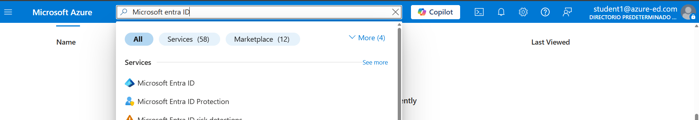

Paso 4. Dentro de **Microsoft Entra ID**, busca la opción **App Registrations** en la sección de **Manage**.

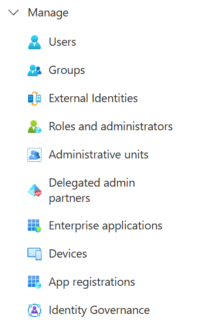

Paso 5. Crea un nuevo registro de aplicación al dar clic en **+ New registration**.

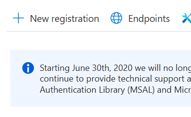

Paso 6. Añade los siguientes datos al registro de la aplicación:

- **Name:** claseapp**tusiniciales**
- **Supported account types:**  Accounts in this organizational directory only

- **Redirect URI**: Web

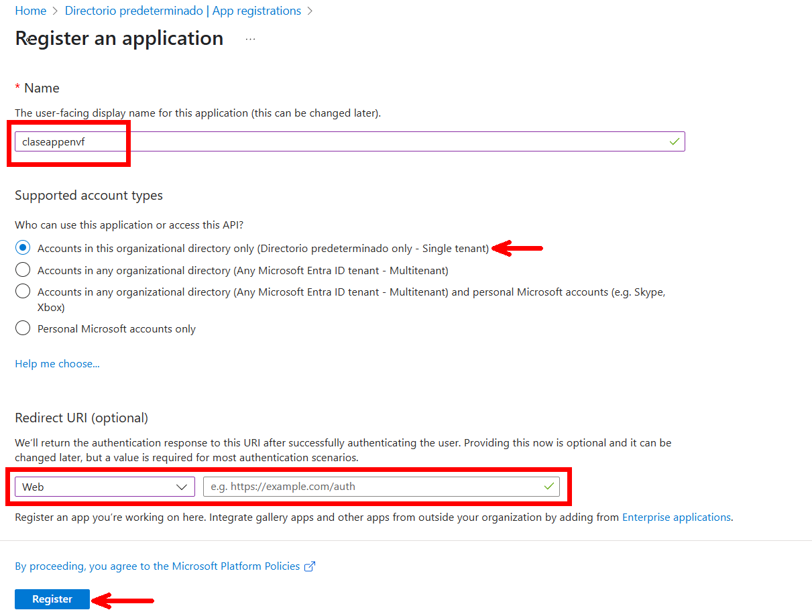

Paso 7. Una vez creada la aplicación, en la pestaña **Overview** verás los siguientes datos (guárdalos en un **notepad**): 

- **Application (client) ID**
- **Directory (tenant) ID**

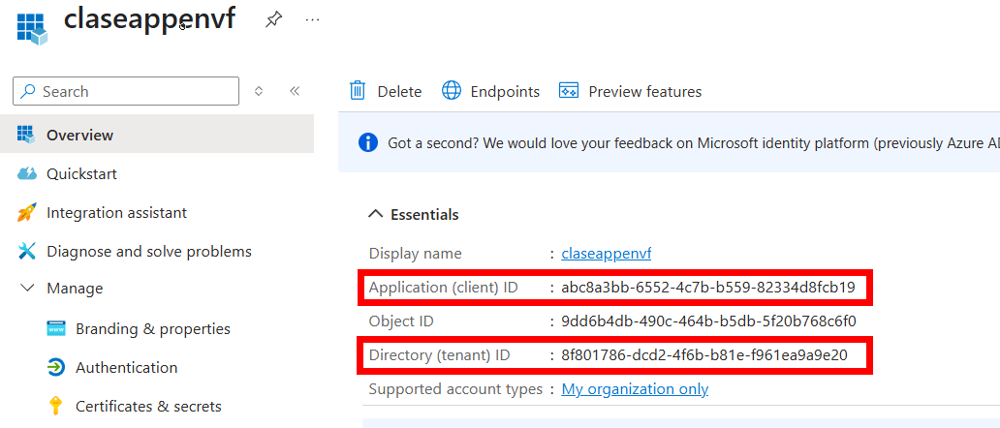

Paso 8. Ahora genera un secreto navegando a **Manage ➡️ Certificates & Secrets**

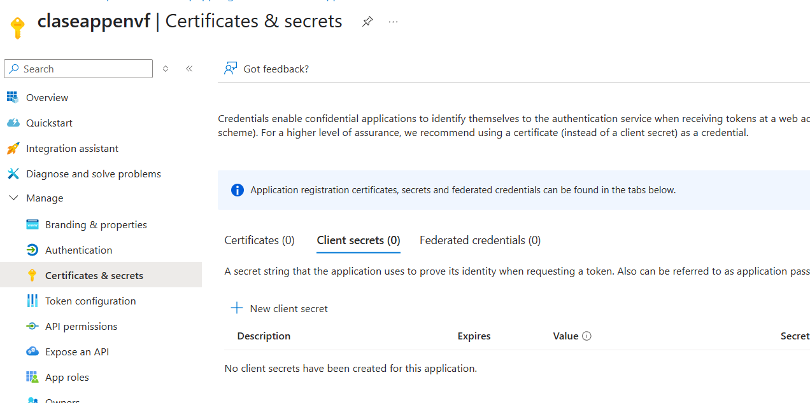

Paso 9. Configura el secreto con bajo los valores siguientes:

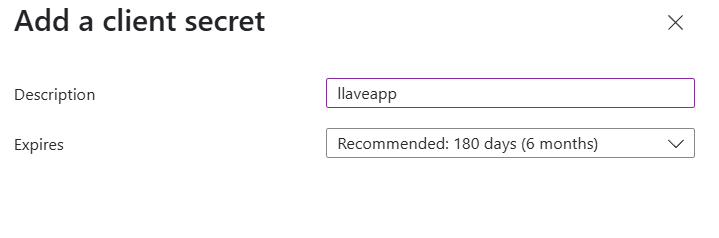

Paso 10. Una vez generado, se mostrará el valor del secreto. **Cópialo de inmediato, ya que no podrás recuperarlo después**

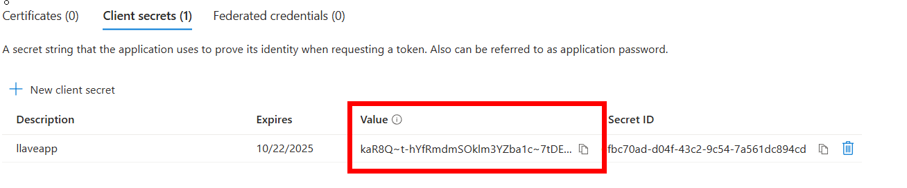

Paso 11. Guarda el valor del secreto en el mismo Notepad donde almacenaste el client ID y el tenant ID. 

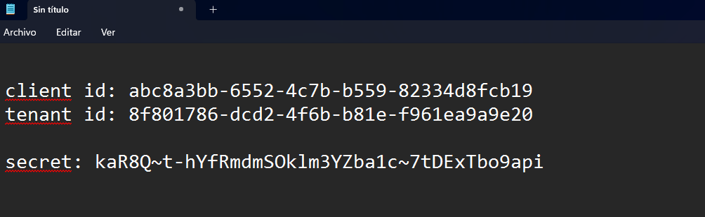

## Configuración Azure Key Vault[return](#instrucciones)
Paso 1. Abrir el portal de azure **https://portal.azure.com**

Paso 2. En la barra de busqueda escribiremos **Resource Groups**

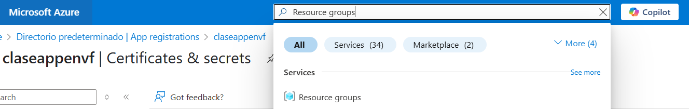

Paso 3. Si no tenemos un grupo de recursos crearemos uno

Paso 4. En el grupo de recursos crearemos un nuevo recurso **+Create**

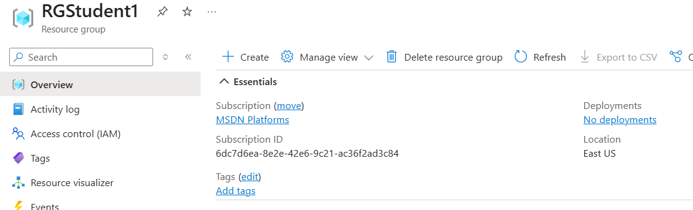

Paso 5. Buscaremos **Key Vault**

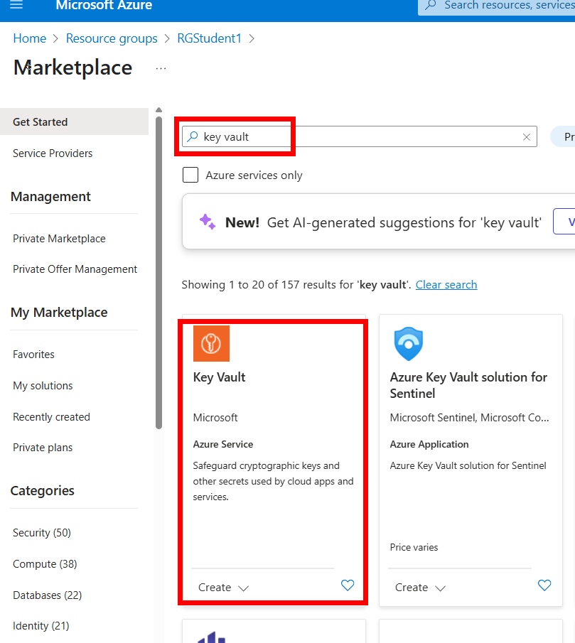

Paso 6. La configuración del key vault, usaremos la siguiente: 

- **Subscription:** *suscripción que puedas usar para crear recursos*
- **Resource Group:** *Grupo de recursos disponible (si no hay crear uno nuevo)*
- **Key vault name:** *keyvault**tusiniciales***
- **Region:** East US
- **Pricing tier:** Standard
- **todas las demás opciones se dejan por default pulsar review + create**

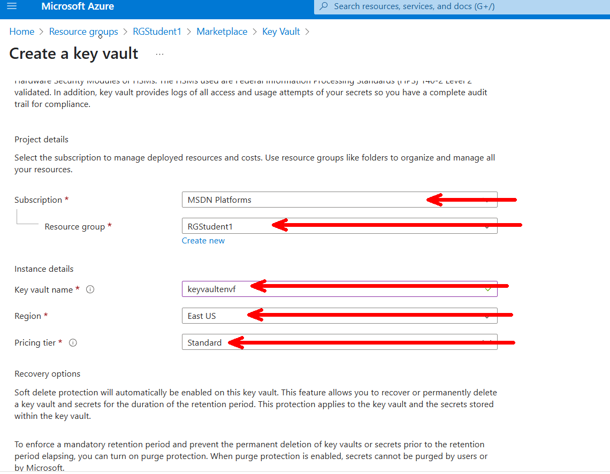

Paso 7. Abrir el **Azure Key Vault** creado y abrir la opción **Access control IAM** (añadiremos 2 roles)
- **Rol 1: KeyVault Adminstrator**: Este rol se le agrega a nuestra cuenta de Azure, esto permite que podamos administrar la herramienta y agregar información.

- **Rol 2: Key Vault Secrets User**: Este rol se le agrega a nuestra aplicación registrada en azure y permite que nuestra app pueda obtener los secretos de **Azure Key Vault**. 

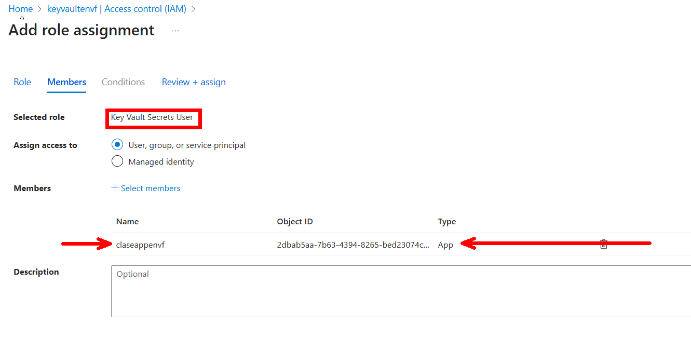

Paso 8. En la opción de **Overview** de azure key vault vamos a copiar **Vault URI** y lo almacenaremos en nuestro notepad

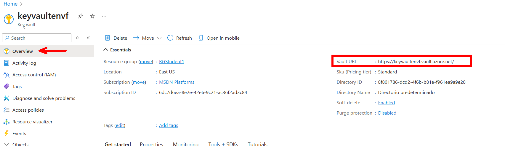

Paso 9. Ahora nos vamos a la sección de **Objects->Secrets**

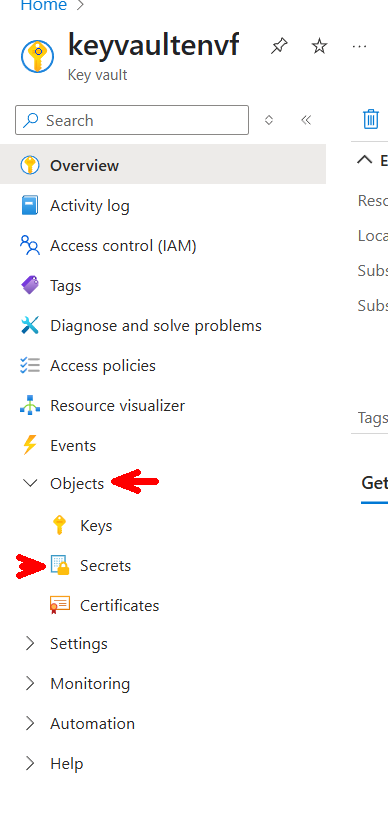

Paso 10. Generaremos 2 secretos 
- **db-user**: root
- **db-password**: 1234 

> **NOTA:** Estos valores cambiarán conforme cambie la base de datos. 

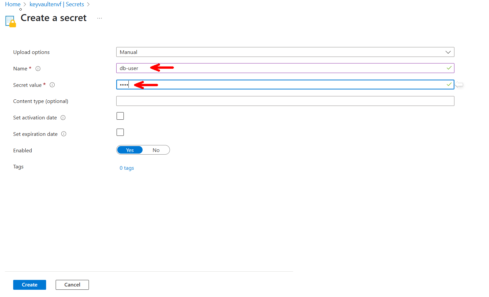

Paso 11. Validamos que los 2 secretos se hayan creado. 

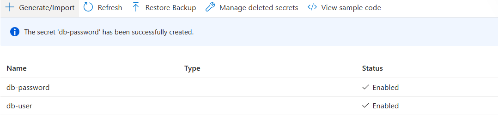

Paso 12. Fin configuración **Azure Key Vault** antes de pasar a la siguiente sección asegurate que en tu notepad tengas la siguiente información:

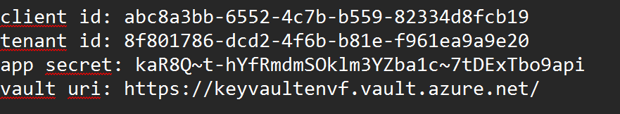

## Configuración Microservicio Cliente [return](#instrucciones)

Paso 1. En el archivo **requirements.txt**, agrega: 
 
- **azure-identity==1.23.0**
- **azure-keyvault-secret==4.9.0**

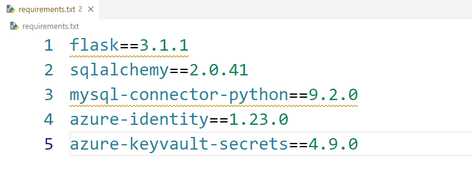

Paso 2. Instala los paquetes usando el siguiente comando (asegúrate de estar en la misma carpeta donde se encuentra el archivo **requirements.txt**): 

```bash
pip install -r requirements.txt
```

Paso 3. Instala el paquete **python-dotenv** para poder usar variables de ambiente.

> 💡***Nota**: Este paquete solo se utiliza en el ambiente de desarrollo, así que **no es necesario agregarlo al archivo** requirements.txt.*

```bash
pip install python-dotenv
```

Paso 4. En la raíz del proyecto, crea un archivo llamado **.env** y añade los datos que obtuviste de Azure como variables de ambiente:

```properties
AZURE_TENANT_ID=<tenant_id>
AZURE_CLIENT_ID=<client_id>
AZURE_CLIENT_SECRET=<app_secret>
```

Paso 5. En la carpeta **database**, crea un archivo llamado **secrets.py** y añade el siguiente código:

**secrets.py**
```python
import os
from azure.identity import DefaultAzureCredential
from azure.keyvault.secrets import SecretClient

#delete in production
from dotenv import load_dotenv
load_dotenv()


key_vault_uri=os.getenv("KEYVAULT_URI","https://keyvaultenvf.vault.azure.net/")

#auth azure
credential=DefaultAzureCredential()

#create keyvault client
client=SecretClient(vault_url=key_vault_uri, credential=credential)

def get_secret(name_secret:str)->str:
    try:
        return client.get_secret(name=name_secret).value
    except Exception as ex:
        print(f"error get secret {ex}")
```

Paso 6. En el archivo **configuration.py** que se encuentra en la carpeta **database** modifícalo con el siguiente código:

**configuration.py**
```python
import os
from .secrets import get_secret


name_db=os.getenv("NAME_DB","appdb")
user_db=get_secret("db-user")
password_db=get_secret("db-password")
ip_db=os.getenv("IP_DB","localhost")
port_db=os.getenv("PORT_DB","3306")

class Config:
    SQLALCHEMY_DATABASE_URI=f"mysql+mysqlconnector://{user_db}:{password_db}@{ip_db}:{port_db}/{name_db}"
    SQLALCHEMY_TRACK_MODIFICATIONS=False

```

Paso 7. Ejecuta la aplicación de Python. 

## Resultado esperado: 
Si has llegado hasta aquí, ya deberías poder ejecutar las operaciones del microservicio sin ningún problema. 

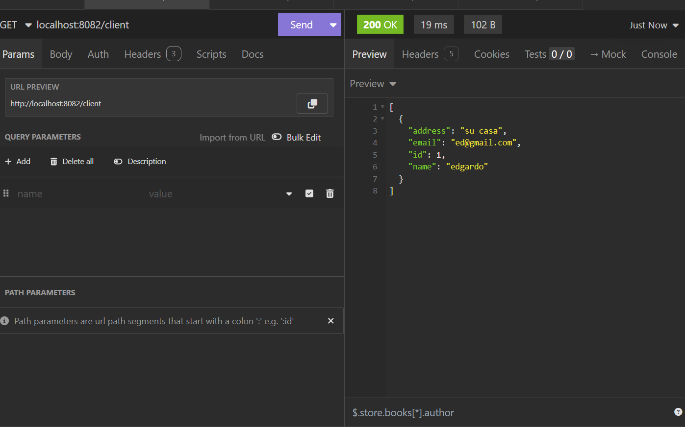

---

**[⬅️ Atrás](https://netec-mx.github.io/DEVSECOPS_PYT/Capitulo3/)** | **[🗂️ Lista general](https://netec-mx.github.io/DEVSECOPS_PYT/)** | **[Siguiente ➡️](https://netec-mx.github.io/DEVSECOPS_PYT/Capitulo5/)**

---
