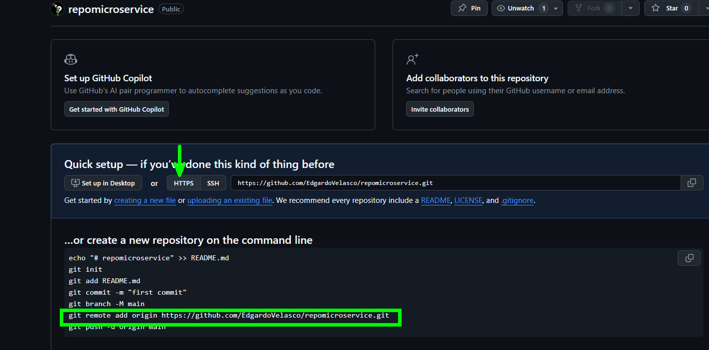

# 5. Añadir seguridad en CICD para el Microservicio Cliente
Para automatizar la construcción, pruebas y liberación del proyecto es necesario Crear un CI/CD usando github actions. Aunque nos centraremos más en las pruebas de seguridad de nuestro proyecto. 


## Objetivos
- Configurar un repositorio en github
- Sincronizar nuestro microservicio cliente con el repositorio remoto
- Crear un CI/CD con pruebas de seguridad para validar automaticamente el código del microservicio. 

---
<div style="width: 400px;">
        <table width="50%">
            <tr>
                <td style="text-align: center;">
                    <a href="../Capitulo4/"></a>
                    <br>anterior
                </td>
                <td style="text-align: center;">
                   <a href="../README.md">Lista Laboratorios</a>
                </td>
<td style="text-align: center;">
                    <a href="../Capitulo6/"></a>
                    <br>siguiente
                </td>
            </tr>
        </table>
</div>

---

## Diagrama


> **IMPORTANTE:** Antes de comenzar este laboratorio necesitas tener una cuenta de **Github gratuita**, y una cuenta de **Docker hub**, en el caso de no tenerlas es necesario los siguientes enlaces **[Github Free account](https://github.com/)** y **[Docker hub Free account](https://hub.docker.com/)**


## Instrucciones
Este laboratorio esta separado en las siguientes secciones: 

- **[Configuración repositorio en github](#configuración-repositorio-en-github-return)**

- **[Configuración Microservicio Cliente](#configuración-microservicio-cliente-return)**

- **[Crear github Action](#crear-github-action-return)**

- **[Validar Github Action](#validar-github-action-return)**

## Configuración repositorio en github [return](#instrucciones)
1. Crear un nuevo repositorio en github con los siguientes datos: 
- **repository name:** repomicroservice

- **Public:** checked

- **Las demás opciones por default**


2.  Al crear el repositorio nos mostrará algunos comandos importantes, vamos a copiar el comando que comience con **git remote add origin url_repositorio** y activamos **HTTPS**



3. Fin configuración repositorio remoto. 


## Configuración Microservicio cliente [return](#instrucciones)

> **IMPORTANTE:** Para esta sección es fundamental tener instalado **git** en el caso de no tenerlo, descargarlo de la siguiente ruta **[git download](https://git-scm.com/downloads)**


1. Abrir el microservicio cliente en **Visual Studio Code** 

2. Modificar el archivo **secrets.py** que se encuentra en la carpeta **database** y comentar la carga de las variables de ambiente:

**secrets.py**
```python
import os
from azure.identity import DefaultAzureCredential
from azure.keyvault.secrets import SecretClient

#delete in production
#from dotenv import load_dotenv
#load_dotenv()


key_vault_uri=os.getenv("KEYVAULT_URI","https://keyvaultenvf.vault.azure.net/")

#auth azure
credential=DefaultAzureCredential()

#create keyvault client
client=SecretClient(vault_url=key_vault_uri, credential=credential)

def get_secret(name_secret:str)->str:
    try:
        return client.get_secret(name=name_secret).value
    except Exception as ex:
        print(f"error get secret {ex}")
```

2. Crear un archivo que llamaremos **.dockerignore** en la raíz del proyecto, donde agregaremos lo siguiente:

**.dockerignore**
```properties
.sonarlint
.vscode
.env
Dockerfile
__pycache__/
*.pyc
cicd.yaml
```

3. Crearemos un archivo que llamaremos **Dockerfile** con el siguiente contenido: 

```Dockerfile
# Dockerfile
FROM python:3.13-slim
WORKDIR /app
COPY requirements.txt .
RUN pip install --no-cache-dir -r requirements.txt \
    && pip install gunicorn
COPY . .
EXPOSE 8082
CMD ["gunicorn", "--bind", "0.0.0.0:8082", "app:app"]
```

4. Ahora agregaremos un nuevo archivo en la raíz del proyecto con el nombre **.gitignore** donde agregaremos el siguiente contenido: 

**.gitignore**
```properties
.env
.vscode
.sonarlint
__pycache__/
*.pyc
```


5. Abrimos una terminal en la carpeta donde se encuentra nuestro proyecto y ejecutamos los siguientes comandos:

```bash
git init
```

```bash
git add .
```

```bash
git commit -m "clase"
```

```bash
git remote add origin <URI_repository_git>
```

```bash
git push --set-upstream origin master
```

> **IMPORTANTE:** Este último comando nos pedirá iniciar sesión en nuestra cuenta de github


6. Al visitar nuestro repositorio en github podremos observar que nuestro código de python ya se encuentra cargado en **github**


## Crear github Action [return](#instrucciones)

1. En el repositorio de **Github** donde se encuentra tu **Microservicio cliente** buscaremos la sección **Actions**


2. Seleccionaremos la opción **set up a workflow yourself**


3. Añadir el siguiente flujo YAML, para realizar el CICD


```yaml
name: CI/CD Microservice Python

on:
  push:
    branches:
      - master

jobs:
  build-test-scan:
    runs-on: ubuntu-latest

    steps:
      - name: Checkout repo
        uses: actions/checkout@v3

      - name: Set up Python
        uses: actions/setup-python@v4
        with:
          python-version: '3.13'

      - name: Install dependencies
        run: |
          python -m pip install --upgrade pip
          pip install -r requirements.txt


      - name: Safety security scan
        run: |
          pip install safety
          safety check --full-report

      - name: Snyk vulnerability scan
        uses: snyk/actions/python@master
        with:
          command: monitor
        env:
          SNYK_TOKEN: ${{ secrets.SNYK_TOKEN }}

      - name: Build Docker image
        run: docker build -t ${{ secrets.DOCKER_USERNAME }}/devsecopspy:${{ github.sha }} .
        working-directory: .

      - name: Log in to Docker Hub
        uses: docker/login-action@v3.3.0
        with:
          username: ${{ secrets.DOCKER_USERNAME }}
          password: ${{ secrets.DOCKER_PASSWORD }}

      - name: Push Docker image to Docker Hub
        run: |
          docker tag ${{ secrets.DOCKER_USERNAME }}/devsecopspy:${{ github.sha }} ${{ secrets.DOCKER_USERNAME }}/devsecopspy:microserviceclient
          docker push ${{ secrets.DOCKER_USERNAME }}/devsecopspy:microserviceclient

```


4. Realizar el **commit** 
5. Añadir los siguientes **Secretos** en el repositorio


## Validar Github Action [return](#instrucciones)

1. Ir a la sección de **Actions** en nuestro repositorio.

2. Encontraremos nuestro **action** ejecutado correctamente


3. Abrir nuestra cuenta de **docker hub** y validar que se haya creado el repositorio con nuestra imagen lista para ser usada en un despliegue. 


## Resultado Esperado [Instrucciones](#instrucciones)

Se espera que el alumno al final de la ejecución del flujo pueda observar su imagen en su repositorio de **github**


