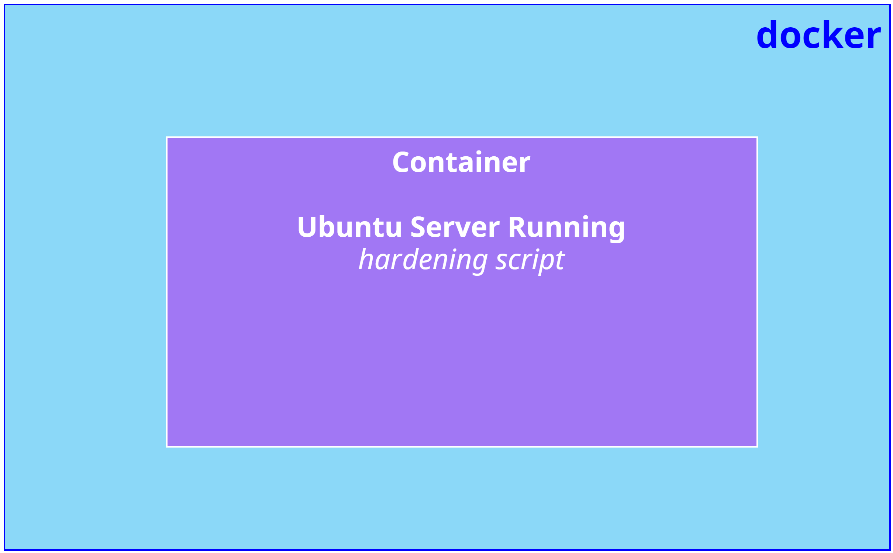
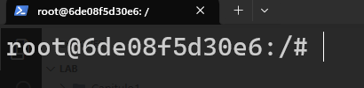
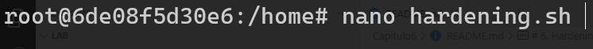
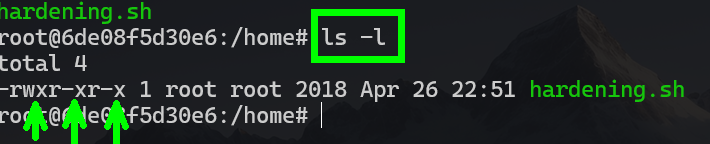
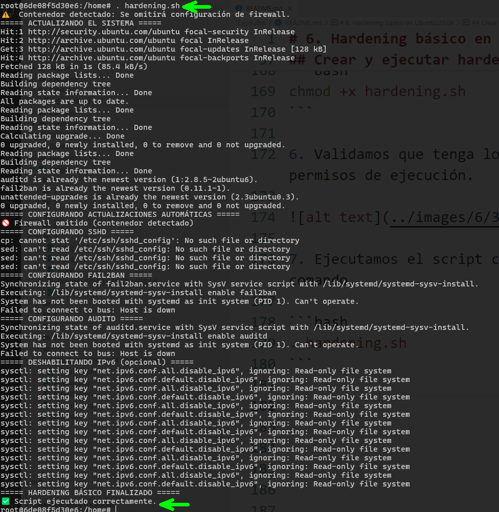

# Práctica 6. Hardening básico en Ubuntu:20.04

## 📝 Planteamiento de la práctica:
En este laboratorio aprenderás cómo asegurar un servidor Ubuntu utilizando un contenedor Docker como servidor de prueba. 

## 🎯 Objetivos:
Al finalizar la práctica, serás capaz de:
- Crear un contenedor Docker con Ubuntu.
- Identificar y aplicar distintos tipos de medidas de seguridad para proteger un servidor.

## 🕒 Duración aproximada:
- 30 minutos.

## 🔍 Objetivo visual:


---

**[⬅️ Atrás](https://netec-mx.github.io/DEVSECOPS_PYT/Capitulo5/)** | **[🗂️ Lista general](https://netec-mx.github.io/DEVSECOPS_PYT/)** | **[Siguiente ➡️](https://netec-mx.github.io/DEVSECOPS_PYT/Capitulo7/)**

---

## Instrucciones:
Este laboratorio está dividido en las siguientes secciones:

- **[Crear contenedor Ubuntu Server](#crear-un-contenedor-ubuntu-return)**

- **[Crear y ejecutar hardening script](#crear-y-ejecutar-hardening-script-return)**

## Crear un contenedor Ubuntu [return](#instrucciones)
Paso 1. Abre una terminal y ejecuta el siguiente comando: 

```bash
 docker run -it --name ubuntu_server --entrypoint /bin/bash ubuntu:20.04
```

> 💡 ***Nota:** Este comando creará un contenedor con la imagen `ubuntu:20.04` en ejecución. Al finalizar, se abrirá una nueva terminal.*



## Crear y ejecutar hardening script [return](#instrucciones)

Paso 1. Con la terminal del contenedor abierta, dirígete a la ruta **home**.

```bash
cd /home
```

Paso 2. Una vez en **home**, ejecuta los siguientes comandos:

```bash
apt-get update
apt-get install nano
```

> 💡 ***Nota:** Por defecto, Docker no incluye un editor de archivos, así que instalaremos **nano** para poder crear y creación del script.*

Paso 3. Crea un archivo llamado **hardening.sh** con el siguiente comando: 

```bash
nano hardening.sh
```



Paso 4. En el archivo, añade el siguiente código en bash, que implementa algunas fases básicas de hardening: 

- Actualiza el sistema.
- Instala herramientas de seguridad básica (fail2ban, auditd).
- Configura las actualizaciones automáticas.
- Configura u omite el firewall, según sea contenedor o no.
- Endurece SSH.
- Desactiva IPv6.

```bash
#!/bin/bash


# Comprobar si es root
if [ "$(id -u)" -ne 0 ]; then
    echo "Este script debe ejecutarse como root. Usa 'sudo ./harden_ubuntu.sh'"
    exit 1
fi

# Detectar si estamos en un contenedor
if [ -f /.dockerenv ] || grep -qa container=lxc /proc/1/environ; then
    echo "⚠️  Contenedor detectado: Se omitirá configuración de firewall."
    SKIP_FIREWALL=1
else
    SKIP_FIREWALL=0
fi

echo "===== ACTUALIZANDO EL SISTEMA ====="
apt update && apt upgrade -y
apt install -y unattended-upgrades fail2ban auditd

echo "===== CONFIGURANDO ACTUALIZACIONES AUTOMÁTICAS ====="
/bin/bash -c 'echo "Unattended-Upgrade::Automatic-Reboot \"true\";" > /etc/apt/apt.conf.d/50unattended-upgrades'

if [ "$SKIP_FIREWALL" -eq 0 ]; then
    echo "===== CONFIGURANDO UFW (FIREWALL) ====="
    apt install -y ufw
    ufw default deny incoming
    ufw default allow outgoing
    ufw allow 2222/tcp    # Puerto para SSH
    ufw allow 80/tcp      # HTTP
    ufw allow 443/tcp     # HTTPS
    ufw --force enable
else
    echo "🚫 Firewall omitido (contenedor detectado)"
fi

echo "===== CONFIGURANDO SSHD ====="
# Respaldar sshd_config
cp /etc/ssh/sshd_config /etc/ssh/sshd_config.bak

sed -i 's/#Port 22/Port 2222/' /etc/ssh/sshd_config
sed -i 's/PermitRootLogin yes/PermitRootLogin no/' /etc/ssh/sshd_config
sed -i 's/#PasswordAuthentication yes/PasswordAuthentication no/' /etc/ssh/sshd_config

# Solo reiniciar ssh si no estamos en contenedor (en contenedor a veces SSH ni está corriendo)
if [ "$SKIP_FIREWALL" -eq 0 ]; then
    systemctl reload sshd
fi

echo "===== CONFIGURANDO FAIL2BAN ====="
systemctl enable fail2ban
systemctl start fail2ban

echo "===== CONFIGURANDO AUDITD ====="
systemctl enable auditd
systemctl start auditd

echo "===== DESHABILITANDO IPv6 (opcional) ====="
echo "net.ipv6.conf.all.disable_ipv6 = 1" >> /etc/sysctl.conf
echo "net.ipv6.conf.default.disable_ipv6 = 1" >> /etc/sysctl.conf
sysctl -p

echo "===== HARDENING BÁSICO FINALIZADO ====="
echo "✅ Script ejecutado correctamente."
```

Paso 5. Dale permisos de ejecución al script con el siguiente comando:

```bash
chmod +x hardening.sh
```

Paso 6. Verifica que el archivo tenga permisos de ejecuciónn. 



Paso 7. Ejecuta el script con el siguiente comando: 

```bash
. hardening.sh
```



> 💡 ***Nota:** Algunas herramientas podrían no ejecutarse correctamente porque estamos trabajando dentro de un contenedor, lo cual limita el control total sobre el sistema operativo.*

> ⚠️ **IMPORTANTE:** Este es un ejemplo básico de cómo podrías proteger un servidor Ubuntu. Es posible añadir más capas de seguridad si el caso lo requiere. La idea principal del hardening es reducir al máximo el área de ataque de un servidor.

## Resultado esperado: [Instrucciones](#instrucciones)

Se espera que hayas podido ejecutar el proceso de hardening en un servidor con Ubuntu 20.04.


---

**[⬅️ Atrás](https://netec-mx.github.io/DEVSECOPS_PYT/Capitulo5/)** | **[🗂️ Lista general](https://netec-mx.github.io/DEVSECOPS_PYT/)** | **[Siguiente ➡️](https://netec-mx.github.io/DEVSECOPS_PYT/Capitulo7/)**

---
