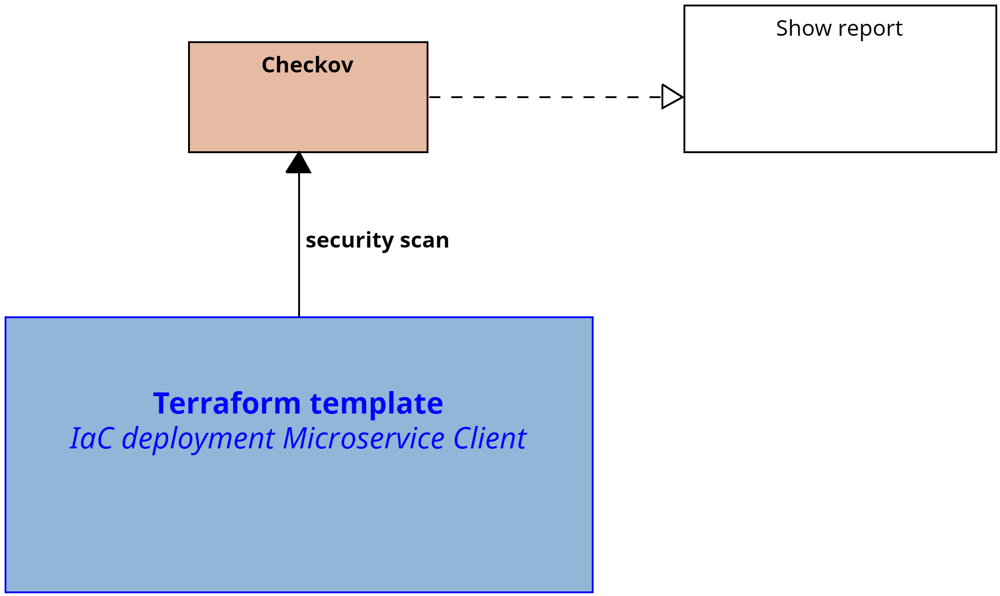
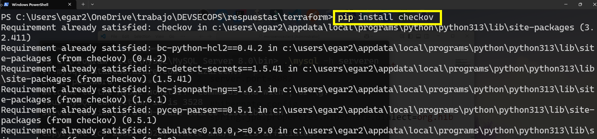
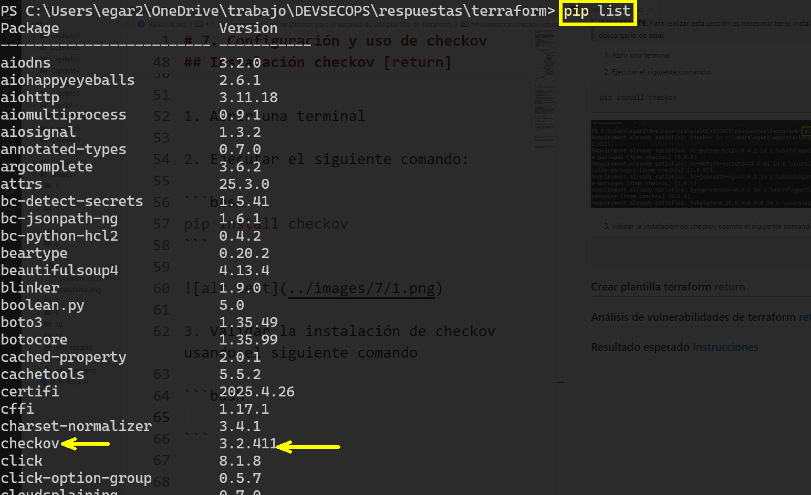
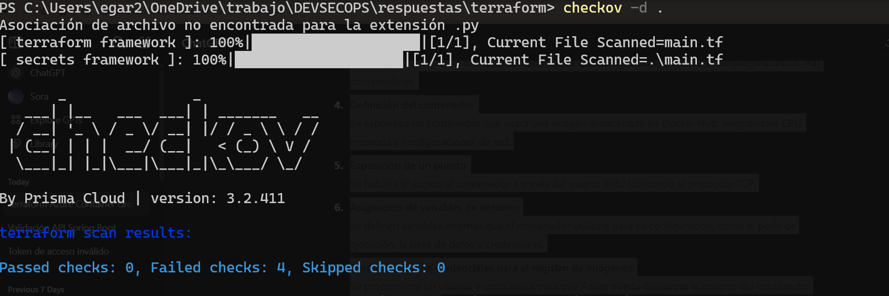
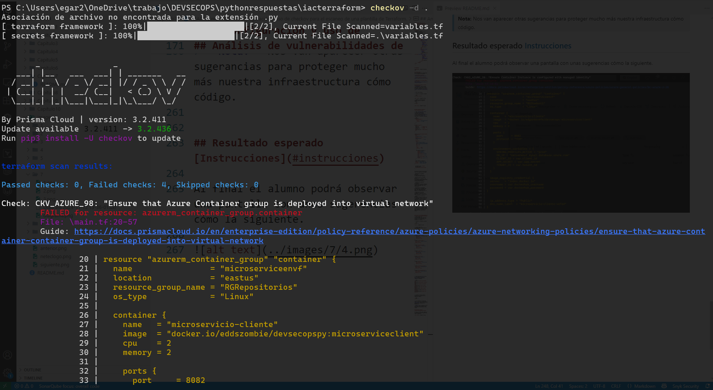

# 7. Configuración y uso de checkov para el escaneo de una plantilla de Terraform. 

En este laboratorio exploraremos la integración continúa usando Github Actions y el almacenamiento de nuestra imagen Docker en Docker hub

## Objetivos
- Installar checkov
- Configurar una plantilla de terraform para nuestro microservicio cliente
- Buscar vulnerabilidades usando checkov 
---

<div style="width: 400px;">
        <table width="50%">
            <tr>
                <td style="text-align: center;">
                    <a href="../Capitulo6/"></a>
                    <br>anterior
                </td>
                <td style="text-align: center;">
                   <a href="../README.md">Lista Laboratorios</a>
                </td>
<td style="text-align: center;">
                    <a href="../Capitulo8/"></a>
                    <br>siguiente
                </td>
            </tr>
        </table>
</div>

---


## Diagrama




## Instrucciones
Este laboratorio esta configurado en las siguientes secciones: 

- **[Instalación checkov](#instalación-checkov-return)**

- **[Crear plantilla terraform](#crear-plantilla-terraform-return)**

- **[Análisis de vulnerabilidades de terraform](#análisis-de-vulnerabilidades-de-terraform-return)**


## Instalación checkov [return](#instrucciones)
> **IMPORTANTE:** Para realizar esta sección es necesario tener instalado a python. En el caso de no tenerlo descargarlo de **[aquí](https://www.python.org/downloads/)**


1. Abrir una terminal 

2. Ejecutar el siguiente comando: 

```bash
pip install checkov
```



3. Validar la instalación de checkov usando el siguiente comando 

```bash
pip list
```




## Crear plantilla terraform [return](#instrucciones)

1. Abrir **Visual Studio Code**
2. Crear una carpeta que llamaremos **terraform**
3. En la carpeta crearemos un archivo que llamaremos **main.tf**
4. En el archivo **main.tf** añadiremos el siguiente contenido: 

```json
terraform {
  required_providers {
    azurerm = {
      source  = "hashicorp/azurerm"
      version = "~> 3.100"
    }
  }
}

provider "azurerm" {
  features {}
  tenant_id       = "<tenant id>"
  client_id       = "<client  id>"
  client_secret   = "<client secret>"
  subscription_id = "<subscription id>"
  
}


resource "azurerm_container_group" "container" {
  name                = "microserviceenvf"
  location            = "eastus"
  resource_group_name = "RGRepositorios"
  os_type             = "Linux"

  container {
    name   = "microservicio-cliente"
    image  = "docker.io/eddszombie/devsecopspy:microserviceclient"
    cpu    = 2
    memory = 2

    ports {
      port     = 8082
      protocol = "TCP"
    }

    environment_variables = {
        NAME_DB="<name db>"
        IP_DB="<ip db>"
        PORT_DB="<port db>"
        AZURE_TENANT_ID="<tenant id>"
        AZURE_CLIENT_ID="<client id>"
        AZURE_CLIENT_SECRET="<app secret>"
        KEYVAULT_URI="<vault uri>/"
    }
  }

  image_registry_credential {
  server   = "index.docker.io"
  username = "<docker user name>"
  password = "<docker password>"
}


  ip_address_type = "Public"
  dns_name_label  = "microservicio-cliente-vefed" 
}

```

El anterior archivo de terraform tiene las siguientes actividades:

- Definición de proveedor requerido:
Se indica que se usará el proveedor de Azure (azurerm).

- Configuración del proveedor Azure:
Se establece la conexión a una suscripción de Azure especificando su ID y habilitando las configuraciones necesarias.

- Creación de un grupo de contenedores:
Se configura un servicio de Azure llamado Azure Container Instance, donde se desplegará uno o más contenedores.

- Definición del contenedor:
Se especifica un contenedor que usará una imagen almacenada en Docker Hub, asignándole CPU, memoria y configuraciones de red.

- Exposición de un puerto:
Se habilita el acceso al contenedor a través del puerto 8082 utilizando el protocolo TCP.

- Asignación de variables de entorno:
Se definen variables internas que el contenedor utilizará para su configuración, como el perfil de ejecución, la base de datos y credenciales.

- Configuración de credenciales para el registro de imágenes:
Se proporciona un usuario y contraseña para que Azure pueda descargar la imagen del contenedor desde Docker Hub.

- Asignación de IP pública y DNS:
Se indica que el contenedor tendrá una dirección IP pública accesible desde internet, y se define un nombre DNS para facilitar su acceso.


## Análisis de vulnerabilidades de terraform [return](#instrucciones)
1. Para escanear las vulnerabilidades del archivo de terraform necesitamos abrir una terminal en la ruta donde se encuentra el archivo. 

2. Ejecutar el siguiente comando:

```bash
checkov -d .
```



3. Análiza todas las recomendaciones de seguridad que te da checkov. 

4. Para proteger las variables de ambiente y solucionar la mayor parte de errores crea un archivo que llamaremos **variables.tf** añadiremos el siguiente contenido:

```json
variable "client_id_app"{
    description = "id cliente app registry"
    type = string
    sensitive = true
}

variable "tenant_id_app" {
  description = "tenant id Azure"
  type = string
  sensitive = true
}

variable "app_secret_app"{
    description = "secret app registry"
    type = string
    sensitive = true
}


variable "client_id"{
    description = "id cliente terraform app"
    type = string
    sensitive = true
}

variable "tenant_id" {
  description = "tenant id terraform app"
  type = string
  sensitive = true
}

variable "app_secret"{
    description = "terraform app"
    type = string
    sensitive = true
}

variable "dockerhub_username" {
  description = "username docker"
  type = string
  sensitive = false
}

variable "dockerhub_password" {
  description = "docker password"
  type = string
  sensitive = true
}

```

5. Ahora añadiremos otro archivo que llamaremos **terraform.tfvars** donde añadiremos el siguiente contenido:

```json
client_id="<client id terraform app>"
app_secret="<app secret terraform app>"
tenant_id="<tenant id terraform app>"
client_id_app="<client id app python>"
app_secret_app="<app secret app python>"
tenant_id_app="<tenant id app python>"
dockerhub_username="<docker hub username>"
dockerhub_password="<docker hub password>"
```


6. Escanear de nuevo nuestra plantilla de terraform con el siguiente comando :

```bash
checkov -d . 
```

7. Si se realiza el escaneo de nuevo el error que nos mostraba de **harcoding** nuestros datos en la plantilla de terraform va a desaparecer. 

> **Nota:** Nos van aparecer otras sugerancias para proteger mucho más nuestra infraestructura cómo código. 


## Resultado esperado [Instrucciones](#instrucciones)

Al final el alumno podrá observar  una pantalla con unas sugerencias cómo la siguiente. 


