# Práctica 8. Análisis de seguridad de Docker y Kubernetes usando Trivy, Checkov y kubescape

## 📝 Planteamiento de la práctica:

En este laboratorio se espera que seas capaz de instalar y utilizar herramientas de análisis de vulnerabilidades para  **Docker images** y **Kubernetes**.

## 🎯 Objetivos:
Al finalizar la práctica, serás capaz de:
- Analizar vulnerabilidades en imágenes de **Docker** (**Trivy**).
- Desplegar un microservicio en **Kubernetes**.
- Analizar vulnerabilidades en archivos **YAML** de Kubernetes (**Trivy**).
- Analizar vulnerabilidades en el clúster de Kubernetes (**kubescape**). 

## 🕒 Duración aproximada:
- 80 minutos.

## 🔍 Objetivo visual:
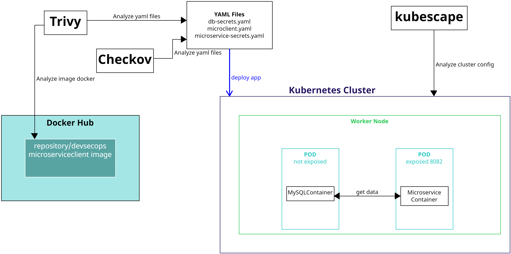

> ⚠️ ***IMPORTANTE**: Antes de comenzar el laboratorio, asegúrate de tener un clúster de Kubernetes configurado. Te recomendamos usar **[Minikube](https://minikube.sigs.k8s.io/docs/start/?arch=%2Fwindows%2Fx86-64%2Fstable%2F.exe+download)**, , aunque también puedes trabajar con un clúster en la nube*

---

**[⬅️ Atrás](https://netec-mx.github.io/DEVSECOPS_PYT/Capitulo7/)** | **[🗂️ Lista general](https://netec-mx.github.io/DEVSECOPS_PYT/)** | **[Siguiente ➡️](https://netec-mx.github.io/DEVSECOPS_PYT/Capitulo9/)**

---
## Instrucciones
Este laboratorio esta dividido en las siguientes secciones:

- **[Análisis de vulnerabilidades de una imagen de Docker](#análisis-de-vulnerabilidades-de-una-imagen-de-docker-return)**

- **[Despliegue de microservicio cliente en Kubernetes](#despliegue-de-microservicio-cliente-en-kubernetes-return)**

- **[Análisis de seguridad de los YAML de despliegue usando Trivy y Checkov](#análisis-de-seguridad-de-los-yaml-de-despliegue-usando-trivy-y-checkov-return)**

- **[Análisis de configuración de clúster de kubernetes](#análisis-de-configuración-de-clúster-de-kubernetes-return)**

## Análisis de vulnerabilidades de una imagen de Docker [return](#instrucciones)

> ⚠️ ***IMPORTANTE**: Este laboratorio requiere que tengas cargada la imagen de Docker de tu microservicio cliente en Docker Hub. Si aún no la has subido, regresa al laboratorio **Añadir seguridad en CICD para el Microservicio Cliente**.*

> ⚠️ ***IMPORTANTE**: Para este laboratorio, es necesario tener instalado el gestor de paquetes Chocolatey. Si aún no lo tienes, puedes consultar las opciones de instalación **[aquí](https://chocolatey.org/install)**.*

Paso 1. Abre una terminal de Windows en modo **Admninistrador**.

Paso  2. Ejecuta el siguiente comando para instalar **Trivy**:

```bash
choco install trivy
```
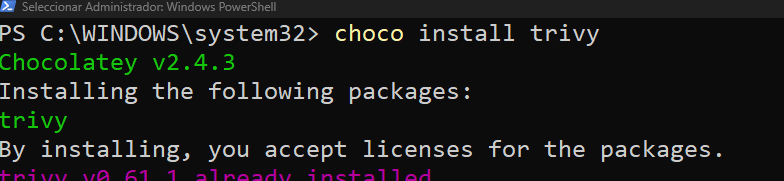

Paso 3. Ahora usa el siguiente comando para descargar tu imagen localmente: 

```bash
docker pull turepositorio/devsecopspy:microserviceclient
```

Paso 4. Valida que tu imagen se encuentre localmente: 

```bash
docker image ls
```

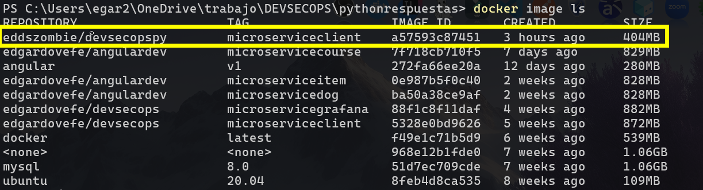

Paso 5. Ahora realizaremos un análisis de seguridad sobre nuestra imagen, mostrando únicamente las vulnerabilidades de nivel alto y crítico:

```
trivy image --severity HIGH,CRITICAL repositorio/devsecopspy:microserviceclient
```

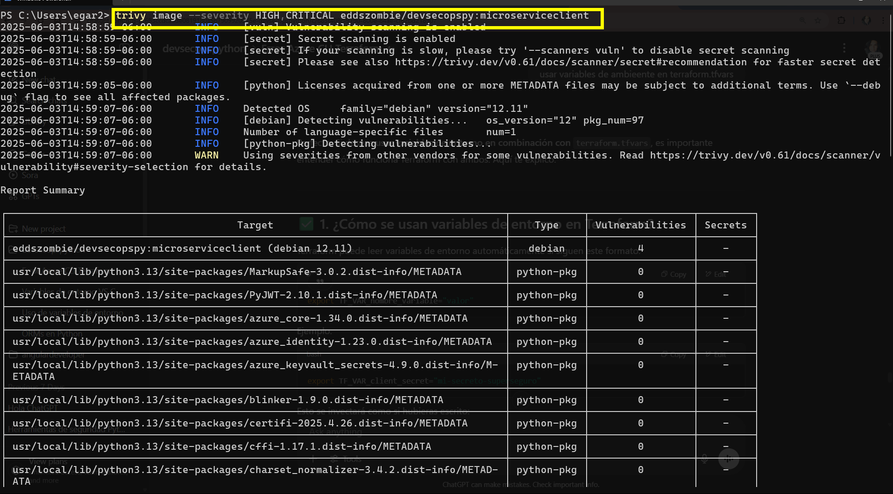

Paso 6. Analiza todas las vulnerabilidades. Como puedes notar, existen solo 4 vulnerabilidades provenientes de la imagen base **python:3.13-slim**. Para resolverlas completamente, se recomienda lo siguiente:

- Crear tu propia imagen personalizada de Python **(muchas empresas adoptan esta práctica)**.
- Exponer únicamente los puertos necesarios, para minimizar posibles puntos de entrada al contenedor. 


## Despliegue de microservicio cliente en Kubernetes [return](#instrucciones)
> ⚠️ ***IMPORTANTE:** Para esta sección, necesitas tener instalados Minikube y kubectl. Si aún no los tienes, puedes instalarlos desde los siguientes enlaces:
> **[Minikube installation](https://minikube.sigs.k8s.io/docs/start/)**
> **[Kubectl installation](https://kubernetes.io/docs/tasks/tools/)***

Paso 1. Abre una terminal de Windows. 
Paso 2. Ejecuta el siguiente comando para iniciar un clúster de Kubernetes de prueba:

```bash
minikube start --driver=docker
```
> ⚠️ ***IMPORTANTE:** Este comando tardará unos minutos.*

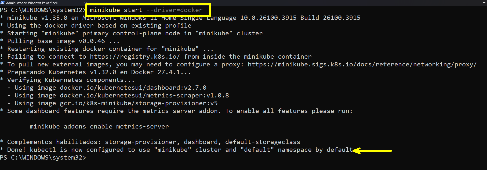

Paso 3. Crea una carpeta en el escritorio y llámala **kubernetes**.

Paso 4. Abre la carpeta en **Visual Studio Code**.

Paso 5. Añade los siguientes archivos dentro de la carpeta: 

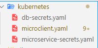

Paso 6. En el archivo **db-secrets.yaml** añadiremos el siguiente contenido: 

```yaml
apiVersion: v1
kind: Secret
metadata:
  name: db-secrets
type: Opaque
data:
  DB_NAME: ZGF0YWRi
  DB_PASSWORD: bmV0ZWMxMjM=
```

> ⚠️ ***IMPORTANTE:** Los valores de DB_NAME y DB_PASSWORD están codificados en Base64.Si necesitas codificar tus propios valores, puedes usar el siguiente comando:*

```powershell
[Convert]::ToBase64String([Text.Encoding]::UTF8.GetBytes("dato"))
```

Paso 7. En el archivo **microservice-secrets.yaml**, añade el siguiente contenido: 

```yaml
apiVersion: v1
kind: Secret
metadata:
  name: microservice-secrets
type: Opaque
data:
  CLIENT_ID: <clientid base64>
  APP_SECRET: <appsecret base64>
  TENANT_ID: <tenantid base64>
```

> ⚠️ ***IMPORTANTE:** Los valores de **CLIENT_ID, APP_SECRET Y TENANT_ID** corresponden a tu **app registration** creada anteriormente, y también deben estar codificados en **base64**.*

Paso 8. En el archivo **microclient.yaml**, añade el siguiente contenido: 

```yaml
#.-.-.-.Service and deployment MySQL.-.-.-.
apiVersion: v1
kind: Service
metadata:
  name: mysql-service
spec:
  selector:
    app: mysqlserver
  ports:
  - port: 3306
  clusterIP: None


---

apiVersion: apps/v1
kind: Deployment
metadata:
  name: mysqlserver
spec:
  selector:
    matchLabels:
      app: mysqlserver
  template:
    metadata:
      labels:
        app: mysqlserver
    spec:
      containers:
      - name: container1
        image: mysql:8.0
        env:
          - name: MYSQL_ROOT_PASSWORD
            valueFrom:
              secretKeyRef:
                name: db-secrets
                key: DB_PASSWORD
          - name: MYSQL_DATABASE
            valueFrom:
              secretKeyRef:
                name: db-secrets
                key: DB_NAME

---

# -.-.--.-.-. Service and deployment MicroserviceClient-.-.-.-.-.-.

apiVersion: v1
kind: Service
metadata:
  name: micro-service
spec:
  selector:
    app: client
  ports:
  - port: 8082
    targetPort: 8082
  type: LoadBalancer


---

apiVersion: apps/v1
kind: Deployment
metadata:
  name: client-deployment
spec:
  selector:
    matchLabels:
      app: client
  template:
    metadata:
      labels:
        app: client
    spec:
      containers:
      - name: container
        image: eddszombie/devsecopspy:microserviceclient
        env:
          - name: IP_DB
            value: 'mysql-service.default'
          
          - name: KEYVAULT_URI
            value: https://keyvaultenvf.vault.azure.net/
          
          - name: NAME_DB
            valueFrom:
              secretKeyRef:
                name: db-secrets
                key: DB_NAME

          - name: AZURE_CLIENT_ID
            valueFrom:
              secretKeyRef:
                name: microservice-secrets
                key: CLIENT_ID
          - name: AZURE_CLIENT_SECRET
            valueFrom:
              secretKeyRef:
                name: microservice-secrets
                key: APP_SECRET
          - name: AZURE_TENANT_ID
            valueFrom:
              secretKeyRef:
                name: microservice-secrets
                key: TENANT_ID
```

> ⚠️ ***IMPORTANTE:** En la sección del despliegue del **microservicio cliente**, asegúrate de modificar la imagen de Docker por la tuya.*

Paso 9. Abre una terminal en la carpeta **kubernetes** y ejecuta el siguiente comando: 

```bash
kubectl apply -f .
```

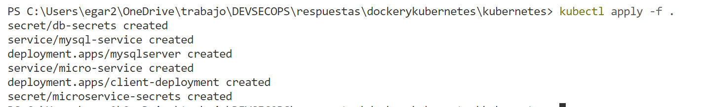

Paso 10. Para validar que todo funciona correctamente, ejecuta el siguiente comando: 

```bash
kubectl get deployments
```

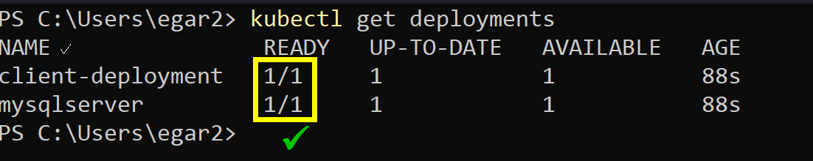

>  💡 ***Nota:** El mensaje READY con un valor de 1 indica que el despliegue y los pods están funcionando correctamente.*

Paso 11. Ejecuta el siguiente comando para probar el microservicio cliente: 

```bash
minikube service micro-service
```
>  💡 ***Nota:** Este comando te proporcionará una URL pública que te permitirá probar el microservicio desde fuera del clúster de Kubernetes.* 

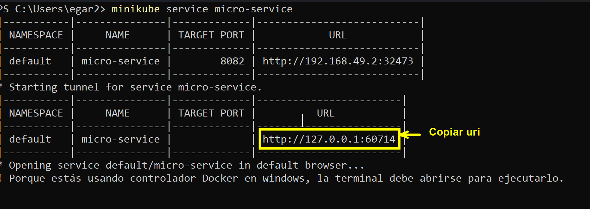

Paso 12. Abre Postman o Insomnia, sustituye **localhost:8082** por la URL copiada y prueba las operaciones del microservicio.

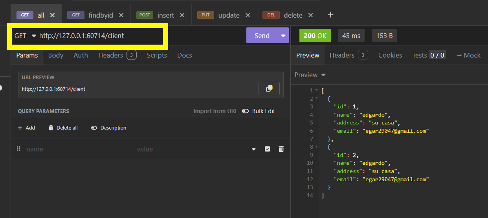

## Análisis de seguridad de los YAML de despliegue usando Trivy y Checkov [return](#instrucciones)

> ⚠️ ***IMPORTANTE:** Para esta sección, necesitas tener instalados **Trivy** y **Checkov**.*

Paso 1. Abre una nueva terminal de Windows.

Paso 2. En la terminal, navega hasta la carpeta **kubernetes**, donde se encuentran los archivos **YAMLS** de tu microservicio. 

Paso 3. Ejecuta el siguiente comando para realizar el análisis con **Trivy**:

```bash
trivy config --severity HIGH,CRITICAL .
```

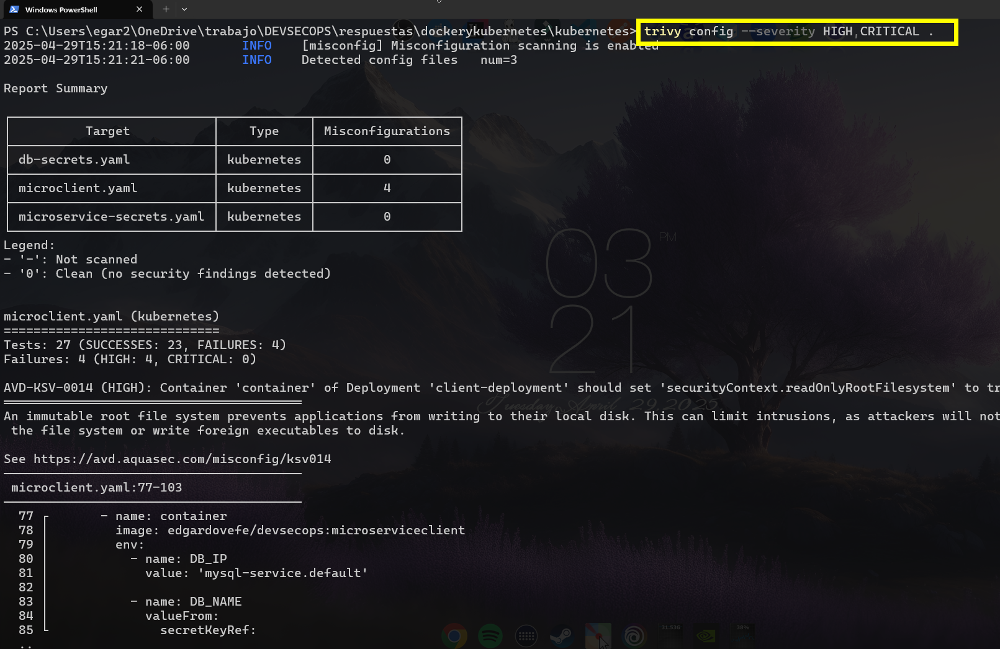

Paso 4. Analiza las recomendaciones que te proporciona, así como los enlaces a la documentación que ofrece para cada hallazgo. 

Paso 5. Ahora, en la misma terminal y desde la carpeta kubernetes, realiza el análisis con Checkov ejecutando el siguiente comando en la carpeta **kubernetes**: 

```bash
checkov -d . 
```

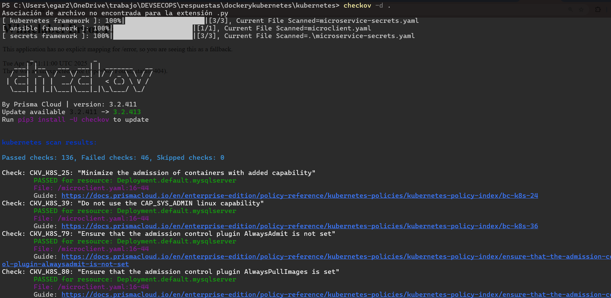

Paso 6. Revisa las recomendaciones de seguridad que te da y valida si coinciden (total o parcialmente) con las que proporcionóambas herramientas. 

## Análisis de configuración de clúster de kubernetes [return](#instrucciones)

Paso 1. Instala la herramienta Kubescape para realizar el análisis de seguridad del clúster de Kubernetes. 

```bash
choco install kubescape
```

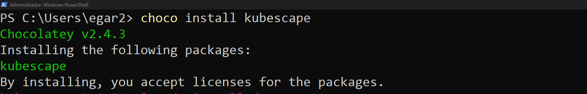

Paso 2. Para analizar la seguridad del clúster de Kubernetes, ejecuta el siguiente comando: 

```bash
kubescape scan framework nsa --exclude-namespaces kube-system,kube-public
```

>  💡 ***Nota:** El comando anterior indica que se analizará el clúster de Kubernetes, omitiendo los namespaces **kube-system y kube-public**.*

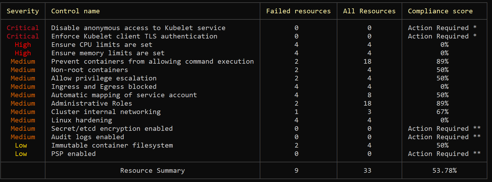

Paso 3. Analiza las recomendaciones para el clúster de Kubernete. 

>  💡 ***Nota:** Al tratarse de un clúster de pruebas, no es necesario modificar los archivos de configuración. Sin embargo, es importante tomar en cuenta estas recomendaciones en entornos de producción.*

## Resultado esperado: [instrucciones](#instrucciones)

Al llegar a este punto, tendrás tres informes de seguridad, generados por cada una de las herramientas utilizadas. 

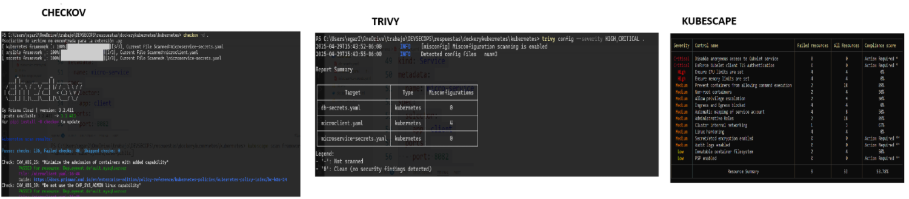

---

**[⬅️ Atrás](https://netec-mx.github.io/DEVSECOPS_PYT/Capitulo7/)** | **[🗂️ Lista general](https://netec-mx.github.io/DEVSECOPS_PYT/)** | **[Siguiente ➡️](https://netec-mx.github.io/DEVSECOPS_PYT/Capitulo9/)**

---
