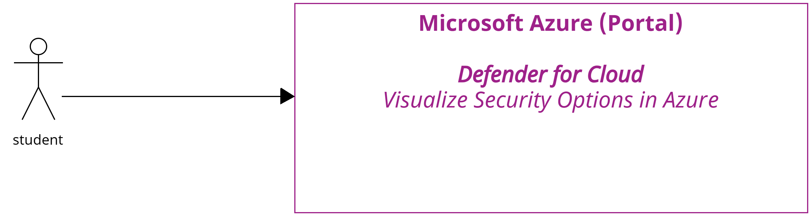
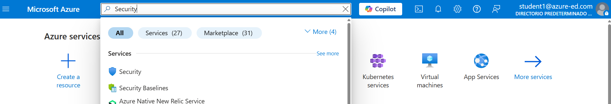
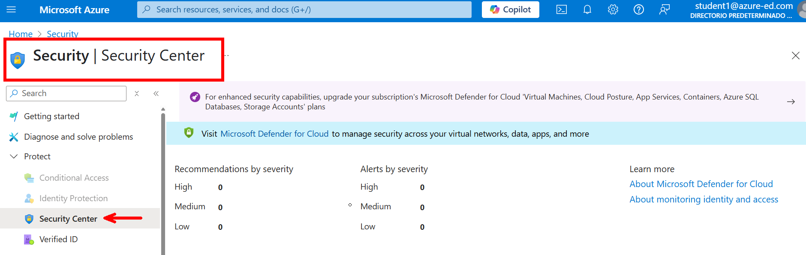
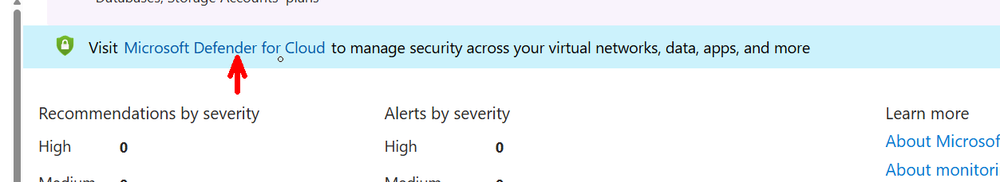
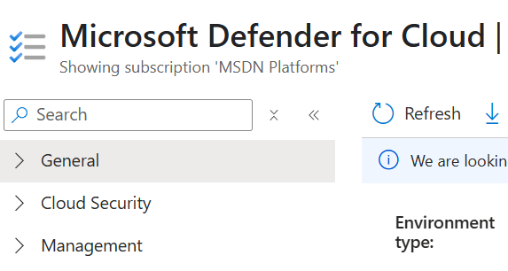
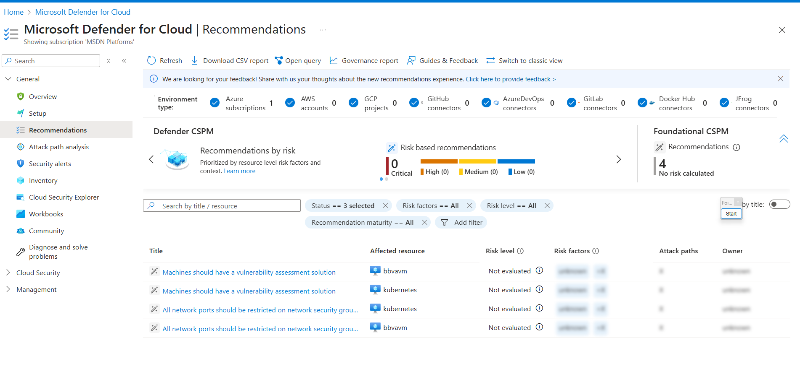
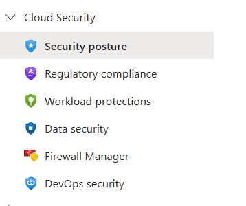
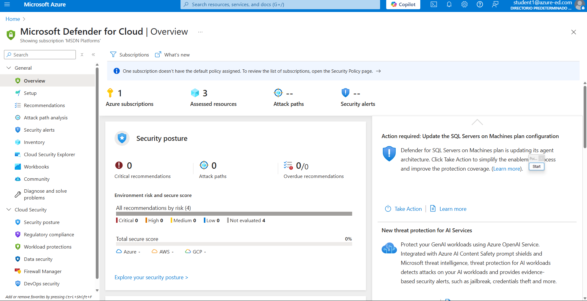

# Práctica 9. Explorando opciones de seguridad en la nube con Azure Security Center
## 📝 Planteamiento de la práctica:

En este laboratorio observarás las opciones de seguridad en Azure utilizando Defender for Cloud.

## 🎯 Objetivos:
Al finalizar la práctica, serás capaz de:
- Entender las opciones de seguridad que ofrece Azure.
- Navegar en Defender for Cloud para comprender las recomendaciones de seguridad en Azure. 

## 🕒 Duración aproximada:
- 30 minutos.

## 🔍 Objetivo visual:

---

**[⬅️ Atrás](https://netec-mx.github.io/DEVSECOPS_PYT/Capitulo8/)** | **[🗂️ Lista general](https://netec-mx.github.io/DEVSECOPS_PYT/)** | **[Siguiente ➡️](https://netec-mx.github.io/DEVSECOPS_PYT/Capitulo10/)**

---

## Instrucciones
> ⚠️ ***IMPORTANTE:** Para realizar este laboratorio necesitas una cuenta de Azure con el rol de **Security Reader**.*

Paso 1. Abre el siguiente enlace: **[https://portal.azure.com](https://portal.azure.com)**.

Paso 2. Inicia sesión con tu cuenta de Azure que tenga los permisos necesarios. 

Paso 3. En la barra de búsqueda, escribe `Security` para acceder a las opciones de seguridad de Azure.

Paso 4. Haz clic en **Security Center**.

Paso 5. Selecciona el vínculo de **Microsoft Defender for Cloud**.

Paso 6. En la herramienta encontrarás tres opciones principales: 

**1. General:** En esta sección podrás ver el estado general de seguridad y las recomendaciones para tu suscripción.
**2. Cloud Security:** Aquí puedes configurar y visualizar los servicios de seguridad específicos según el tipo de recurso.
**3. Management:** Opciones para gestionar la configuración global de Defender for Cloud. 

Paso 7. Abre las recomendaciones de seguridad para tu suscripción en **General ➡️ Recommendations**.

>  💡 ***Nota:** Revisa las recomendaciones y analiza posibles soluciones. Recuerda que solo cuentas con permisos de lectura.*

Paso 8. En la sección **Cloud Security** encontrarás las siguientes opciones: 

Aquí, encontrarás las siguientes opciones: 

- **Security posture**
Objetivo: Visualizar el estado general de seguridad de tu entorno.

    - Incluye:
        - Secure Score: Puntuación basada en recomendaciones aplicadas.
        - Recomendaciones por categoría (identidad, red, almacenamiento, etc.).
        - Recursos afectados y su nivel de riesgo.

- **Regulatory compliance**
Objetivo: Verificar si tus recursos cumplen con estándares como:

    - ISO 27001
    - NIST 800-53
    - CIS Controls
    - GDPR

- **Workload protections**
Objetivo: Activar y administrar planes de protección (Defender plans) para distintos tipos de cargas de trabajo como:

    - Máquinas virtuales
    - Kubernetes (AKS)
    - Bases de datos
    - Azure App Services

- **Data security**
Objetivo: Proteger los datos en reposo y en tránsito.

    - Incluye:
        - Evaluaciones sobre cifrado, acceso y etiquetado de datos.
        - Alertas por acceso no autorizado o configuraciones incorrectas.

- **Firewall Manager**
Objetivo: Centralizar la administración de firewalls (especialmente Azure Firewall).

    - Incluye:
        - Reglas de red, filtrado DNS, protección contra amenazas.
        - Políticas aplicadas a redes virtuales.

- **DevOps security**
Objetivo: Integrar la seguridad en el ciclo de vida del desarrollo.

    - Incluye:
        - Escaneo de código, infraestructura como código (IaC), y pipelines.
        - Detecta vulnerabilidades y malas prácticas antes del despliegue.

## Resultado esperado:
Si has llegado hasta aquí, ya tienes una mejor idea de cómo funciona Security Center de Azure y sus opciones de seguridad.

---

**[⬅️ Atrás](https://netec-mx.github.io/DEVSECOPS_PYT/Capitulo8/)** | **[🗂️ Lista general](https://netec-mx.github.io/DEVSECOPS_PYT/)** | **[Siguiente ➡️](https://netec-mx.github.io/DEVSECOPS_PYT/Capitulo10/)**

---
